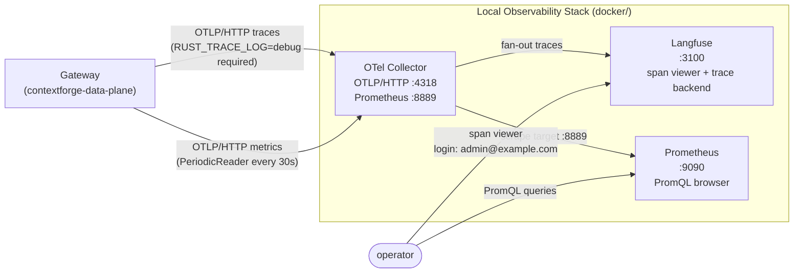
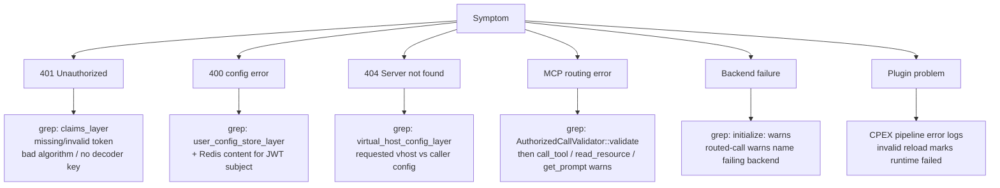

# Configuration Reference

## Minimum Required Flags

```text
--redis-address   --redis-port   --redis-mode
```

Plus at least: `--address` or `--tls-address`, `--token-verification-public-key` or `--token-verification-secret`.

## Key CLI Flags (env var: `CONTEXTFORGE_DATA_PLANE_*`)

| Flag | Env suffix | Default | Note |
| --- | --- | --- | --- |
| `--address` | `ADDRESS` | — | Plain HTTP listener |
| `--tls-address` | `TLS_ADDRESS` | — | Requires cert + key |
| `--server-certificate` | `TLS_SERVER_CERTIFICATE` | — | With `--tls-address` |
| `--server-private-key` | `TLS_SERVER_PRIVATE_KEY` | — | With `--tls-address` |
| `--token-verification-public-key` | `TOKEN_VERIFICATION_PUBLIC_KEY` | — | RSA (RS256/384/512) |
| `--token-verification-secret` | `TOKEN_SECRET` | — | HMAC (HS256/384/512) |
| `--redis-address` | `REDIS_HOSTNAME` | **required** | |
| `--redis-port` | `REDIS_PORT` | **required** | |
| `--redis-mode` | `REDIS_CONNECTION_MODE` | **required** | `plain-text` \| `tls` \| `mtls` |
| `--user-config-cache-expiry-seconds` | `USER_CONFIG_CACHE_EXPIRY_SECONDS` | `60` | `0` = no cache |
| `--upstream-connection-mode` | `UPSTREAM_CONNECTION_MODE` | HTTPS-only | `plain-text-or-tls` for local HTTP backends |
| `--number-of-cpus` | `NUMBER_OF_CPUS` | host CPU count | Tokio worker threads |
| `--single-runtime` | `SINGLE_RUNTIME` | `true` | `false` = multi-runtime (no session affinity) |
| `--runtime-plugins-enabled` | `RUNTIME_PLUGINS_ENABLED` | `false` | Enables CPEX hooks |
| `--enable-open-telemetry` | `ENABLE_OPEN_TELEMETRY` | `false` | OTLP traces |
| `--enable-otel-metrics` | `ENABLE_OTEL_METRICS` | `false` | OTLP metrics |

## JWT Claims (validated by `claims_layer`)

| Claim | Required value |
| --- | --- |
| `iss` | `mcpgateway` |
| `aud` | `mcpgateway-api` |
| `exp` | present, not expired |
| `sub` | → selects Redis user config key |

Optional: `token_use`, `iat`, `teams`, `scopes`, `user.full_name`.

> **No revocation:** a leaked token is valid until `exp`. Rotate the signing key and restart to invalidate all outstanding tokens.

## UserConfig Shape (from `contextforge-data-plane-apis`)

```text
UserConfig
  virtual_hosts: HashMap<String, VirtualHost>

VirtualHost
  backends: HashMap<String, BackendMCPGateway>   ← map key = routing prefix

BackendMCPGateway
  name: String
  url: Url
  transport: STREAMABLEHTTP | SSE | STDIO         ← only STREAMABLEHTTP used today
  passthrough_headers: Vec<String>                ← snapshotted at initialize; session-scoped
  add_headers: HashMap<String, String>            ← injected after passthrough
  remove_headers: Vec<String>                     ← stripped after add
  tool_name_aliases: HashMap<String, String>      ← downstream_alias → upstream_original
  allowed_tool_names: Vec<String>                 ← model exists, NOT currently enforced
  allowed_resource_names: Vec<String>             ← model exists, NOT currently enforced
  allowed_prompt_names: Vec<String>               ← model exists, NOT currently enforced
```

**Header apply order:** `passthrough_headers` → `add_headers` (override passthrough) → `remove_headers` (applied last).

**`passthrough_headers` is session-scoped.** Values are snapshotted from the `initialize` request and baked into the backend transport for the session lifetime. Post-`initialize` calls (tool calls, list calls) reuse those headers. Request-scoped propagation requires per-request transport reconstruction (future work).

**Protected headers** — silently skipped in all three phases (passthrough/add/remove):

| Category | Headers |
| --- | --- |
| Body-framing | `Content-Length`, `Content-Type` |
| Hop-by-hop | `Connection`, `Keep-Alive`, `Proxy-Authenticate`, `Proxy-Authorization`, `Proxy-Connection`, `TE`, `Trailer`, `Trailers`, `Transfer-Encoding`, `Upgrade` |
| RMCP-reserved | `Mcp-Session-Id`, `Accept`, `Last-Event-Id` |
| Gateway-managed | `Host` (set from backend URL host + port; never overridden by config) |

Redis storage: `MessagePack(User::new(sub))` → `MessagePack(UserConfig)`.

Two schemas are generated — both must be regenerated and committed when `UserConfig`, `VirtualHost`, `BackendMCPGateway`, or the `User` key type changes:

| Schema file | Covers |
| --- | --- |
| `schemas/user_config.json` | `UserConfig` routing document written to Redis. |
| `schemas/user.json` | `User` key type used as the Redis key. |

```bash
cargo run -p contextforge-data-plane-apis
```

## Plugin Config (Redis key: `ContextForgeGatewayRuntimePluginConfig`)

```text
RuntimePluginConfigDocument
  version: 1
  cpex: CpexConfig
```

Supported: `cmf.tool_pre_invoke`, `cmf.tool_post_invoke` only.  
Rejected: routing-based selection, plugin dirs, global policies, other hook types.  
Reload watcher: 10-minute interval. Invalid reload → runtime marked failed.

### Tool Call Hook Behavior

For `call_tool`, the pre hook runs after backend routing has selected the backend and stripped the public prefix. The hook sees the backend name, routed tool name, and arguments. It can leave arguments unchanged, replace arguments, or deny the call.

After the upstream backend returns, the post hook can leave the result unchanged, rewrite the result payload, or deny the response. Hook state is carried across the upstream call so pre and post hooks can share CPEX context for the same logical tool call.

Plugin execution must not poison shared gateway state. A plugin denial becomes an MCP error. Soft plugin errors are logged. Unsupported plugin configuration fails validation before the runtime is accepted.

### Demo Plugin Workflow

The optional `test-plugins` feature compiles demo factories from the `cpex-plugins-rs` repository. Redis configuration activates factories already present in the binary; it never loads new Rust code into a running process.

Start lightweight dependencies:

```bash
docker compose -f docker/docker-compose-local.yaml up -d redis gateway-one gateway-two
```

Register payload-marker configuration before starting the data plane:

```bash
docker compose -f docker/docker-compose-local.yaml exec -T redis \
  redis-cli SET ContextForgeGatewayRuntimePluginConfig '{
    "version": 1,
    "cpex": {
      "plugins": [
        {
          "name": "payload-marker",
          "kind": "contextforge/payload-marker",
          "hooks": ["cmf.tool_post_invoke"]
        }
      ]
    }
  }'
```

Build and run with demo factories and runtime execution enabled:

```bash
cargo run -p contextforge-data-plane \
  --features 'contextforge-data-plane-lib/with_tools,test-plugins' \
  --bin contextforge-data-plane -- \
  --address 127.0.0.1:8001 \
  --redis-address 127.0.0.1 \
  --redis-port 6379 \
  --redis-mode plain-text \
  --token-verification-public-key assets/jwt.key.pub \
  --token-verification-private-key assets/jwt.key \
  --upstream-connection-mode plain-text-or-tls \
  --runtime-plugins-enabled true
```

Startup should log successful CPEX initialization. The payload marker appends `[cpex:payload-marker]` to successful tool results. The hook path is also covered by:

```bash
cargo nextest run --locked -p contextforge-data-plane-lib --test gateway_plugins
```

## Startup Validation (fails fast)

| Invalid combo | Reason |
| --- | --- |
| `--tls-address` without cert or key | Rustls needs both |
| Same address for `--address` and `--tls-address` | Cannot bind same socket twice |
| `--redis-mode tls` without trust bundle | Required |
| `--redis-mode mtls` without trust bundle + client cert + key | All three required |
| mTLS upstream without cert and key | reqwest identity cannot be built |
| HTTP backend URL with default upstream mode (HTTPS-only) | Calls fail before reaching backend |

## Upstream Connection Modes

| Mode | Behavior |
| --- | --- |
| omitted / `tls-only` | HTTPS backends only (safe default) |
| `plain-text-or-tls` | HTTP or HTTPS (use for local Compose backends) |
| `plain-text-or-m-tls` | HTTP or HTTPS + client identity |
| `mtls-only` | HTTPS + client cert/key required |

## Logging Env Vars

| Var | Default | Controls |
| --- | --- | --- |
| `RUST_LOG` | `debug` | Console filter |
| `RUST_FILE_LOG` | `debug` | File filter |
| `RUST_TRACE_LOG` | `info` | OTLP span filter (`debug` for local trace verification) |


## Telemetry Debugging Notes

> **`RUST_TRACE_LOG=debug` is required for trace export.** The default (`info`) drops HTTP spans before they reach the OTLP exporter — nothing arrives at the trace backend.

Metrics are pushed by a `PeriodicReader` every **30 seconds**. Allow ~35s after the first request before data appears downstream.

**Stable log prefixes for grepping** (use these to scope log searches by boundary):

| Prefix | Boundary |
| --- | --- |
| `claims_layer` | JWT validation failures |
| `user_config_store_layer` | Config lookup / Redis errors |
| `virtual_host_config_layer` | Unknown virtual host |
| `AuthorizedCallValidator::validate` | Post-session MCP validation |
| `initialize:` | Backend session creation |
| `call_tool` | Tool routing and backend invocation |

**Debugging by symptom:**

| Symptom | Where to look |
| --- | --- |
| `401` | `claims_layer` logs: missing/invalid token, unsupported algorithm, no decoder key |
| `400` config error | `user_config_store_layer` logs + Redis content for the JWT subject |
| `404 Server not found` | `virtual_host_config_layer` debug: requested vhost id vs caller's config |
| MCP routing errors | `AuthorizedCallValidator::validate` debug, then `call_tool`/`read_resource`/`get_prompt` warns |
| Backend failures | `initialize:` warns for failed backends; routed-call warns name the failing backend |
| Plugin problems | CPEX pipeline error logs; invalid reload marks runtime failed |

## Local Telemetry Verification Stack

A complete local observability pipeline ships under `docker/` as overlays:

| Component | Role | Endpoint |
| --- | --- | --- |
| Langfuse | Trace backend and span viewer. | `http://localhost:3100`, login `admin@example.com` / `changeme`, project `ContextForge Data Plane`. |
| OTel Collector | Receives OTLP from the gateway; fans traces and metrics out. | OTLP/HTTP on `:4318`, Prometheus exposition on `:8889`. |
| Prometheus | Scrapes the collector for browsable PromQL. | `http://localhost:9090`. |



**Debugging by symptom:**




Start:
```bash
docker compose \
  -f docker/docker-compose-local.yaml \
  -f docker/docker-compose-langfuse.yaml \
  -f docker/docker-compose-otel-collector.yaml \
  up -d
```

Run the gateway with export enabled (RUST_TRACE_LOG=debug required for trace export):
```bash
RUST_TRACE_LOG=debug \
cargo run --release --bin contextforge-data-plane -- \
  --address 0.0.0.0:8001 \
  --redis-port 6379 --redis-address 127.0.0.1 --redis-mode=plain-text \
  --token-verification-public-key assets/jwt.key.pub \
  --number-of-cpus 4 \
  --upstream-connection-mode=plain-text-or-tls \
  --enable-open-telemetry true \
  --enable-otel-metrics true \
  --otlp-protocol http-protobuf \
  --otlp-endpoint  http://127.0.0.1:3100/api/public/otel/v1/traces \
  --otlp-metrics-endpoint http://127.0.0.1:4318/v1/metrics \
  --otlp-service-name contextforge-data-plane
```

## Prometheus Starter Queries

| Question | Query |
| --- | --- |
| Request count by method, status, service | `http_server_request_duration_seconds_count` |
| p95 latency | `histogram_quantile(0.95, sum by (le) (rate(http_server_request_duration_seconds_bucket[1m])))` |
| In-flight requests | `http_server_active_requests` |
| Payload throughput | `http_server_request_body_size_bytes_sum` / `http_server_response_body_size_bytes_sum` |

## Known Telemetry Gaps

Tracked upstream, not yet implemented in the dataplane:

| Gap | Issue |
| --- | --- |
| W3C trace-context propagation across gateway hops | [mcp-context-forge#4723](https://github.com/IBM/mcp-context-forge/issues/4723) |
| MCP-semantic spans with tool names and JSON-RPC method attributes | [mcp-context-forge#4722](https://github.com/IBM/mcp-context-forge/issues/4722) |
