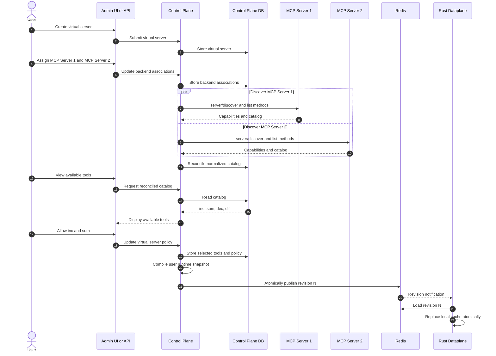
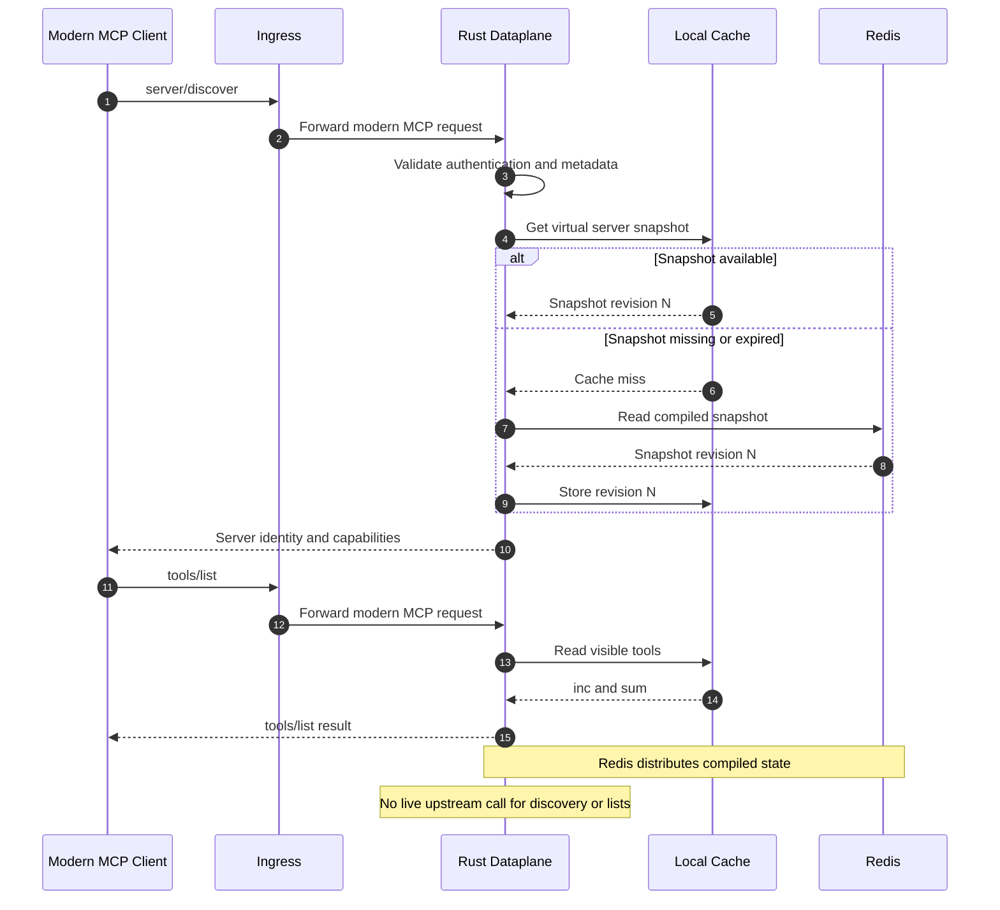
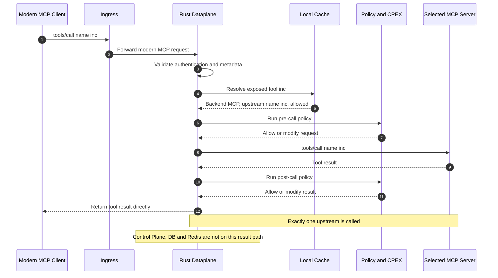
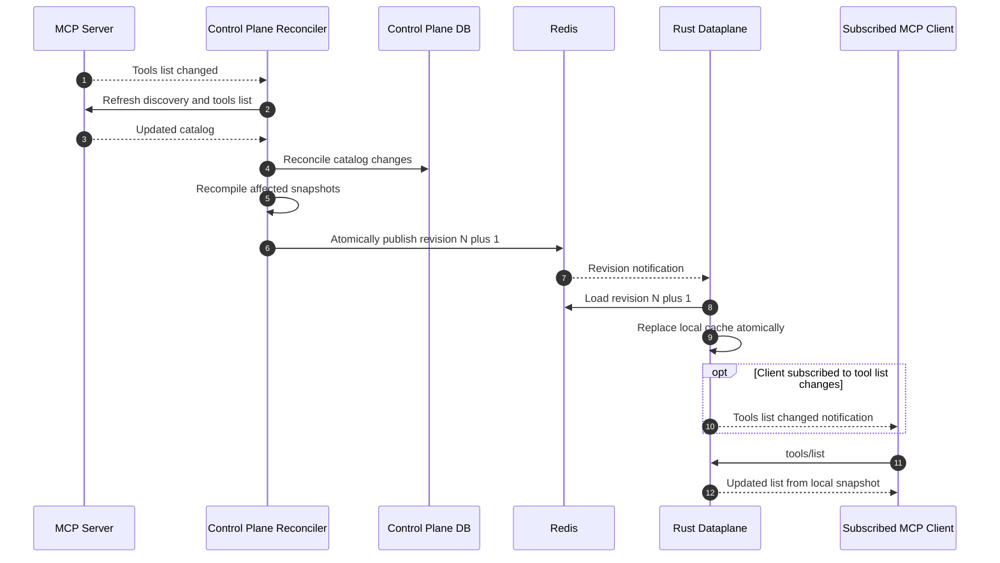

# Phase 3 Final Architecture

> **Tentative:** this is the proposed Phase 3 final architecture and remains
> subject to review.

### 1. Create a Virtual Server and Select Capabilities

### 2. Discover the Server and List Tools

### 3. Call a Tool

### 4. Reconcile an Upstream Catalog Change

