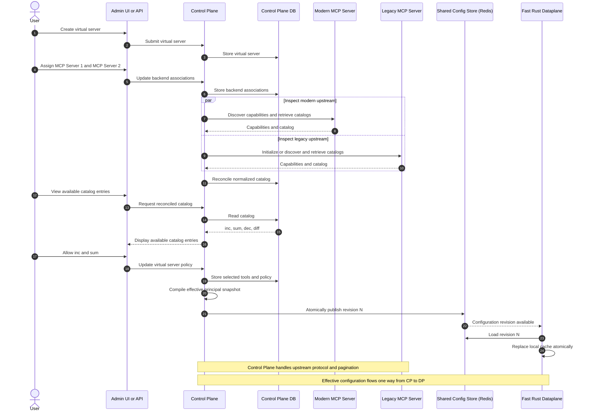
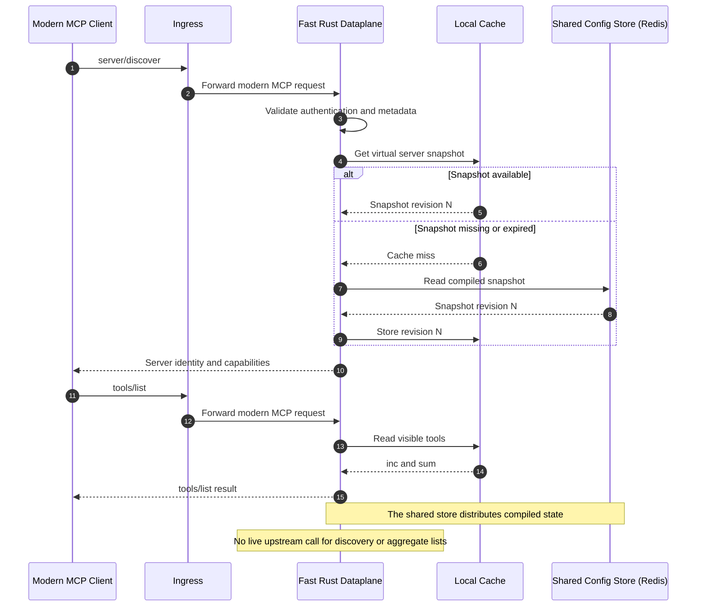
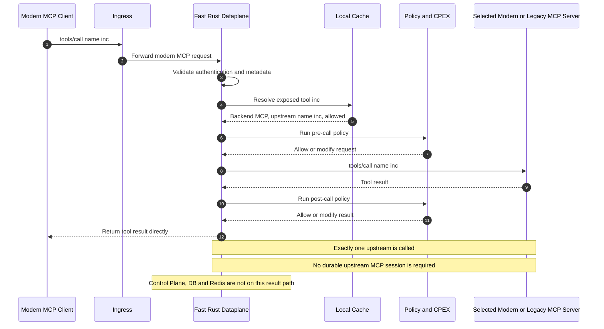
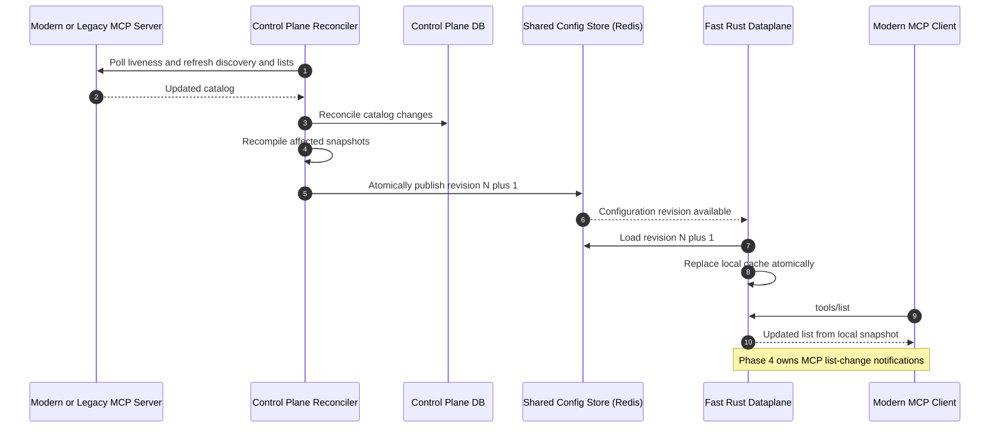

# Phase 3 Final Architecture

> **Tentative:** this is the proposed Phase 3 final architecture and remains
> subject to review.

## Scope and Boundaries

The examples below use tools, but the same ownership applies to resources,
prompts, completions, and other aggregate or targeted MCP methods.

- The fast dataplane serves modern MCP `2026-07-28` clients. Legacy downstream
  clients remain on the slow path.
- The control plane owns upstream fan-out, capability aggregation, catalog
  retrieval and pagination, selection policy, and liveness polling.
- The control plane compiles effective configuration per user, team, or other
  principal and publishes it one way to the dataplane through the shared
  configuration store. Redis is the store shown in these examples.
- For targeted methods, the fast dataplane calls exactly one selected modern
  or legacy upstream. ContextForge does not depend on a durable upstream MCP
  session; legacy upstream session handling is best effort.
- MCP subscriptions and list-changed notifications remain Phase 4 work and are
  outside this Phase 3 architecture.

### 1. Create a Virtual Server and Select Capabilities

### 2. Discover the Server and List Tools

### 3. Call a Tool

### 4. Reconcile an Upstream Catalog Change

