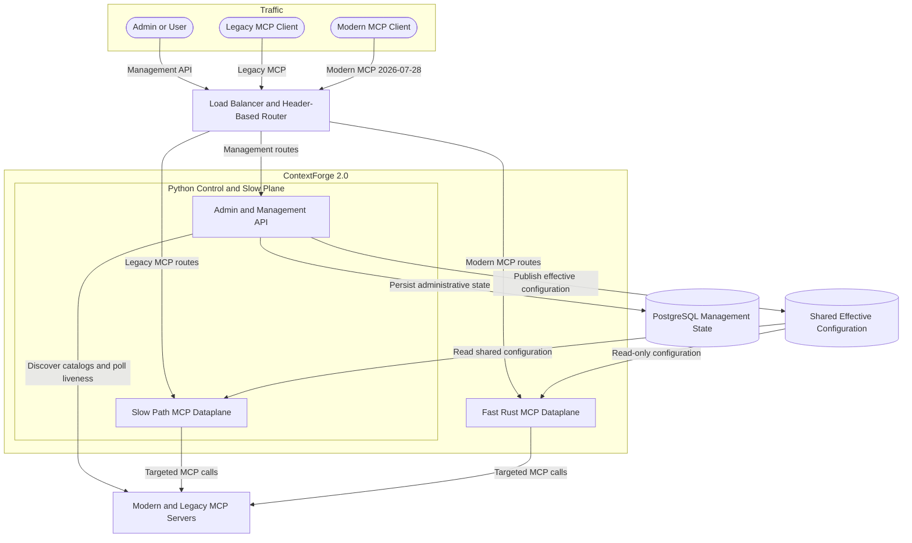
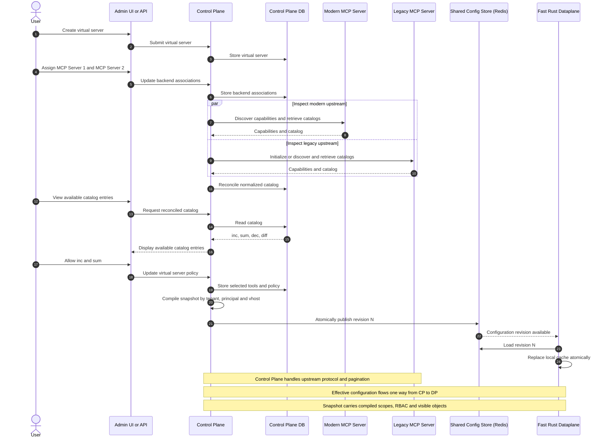
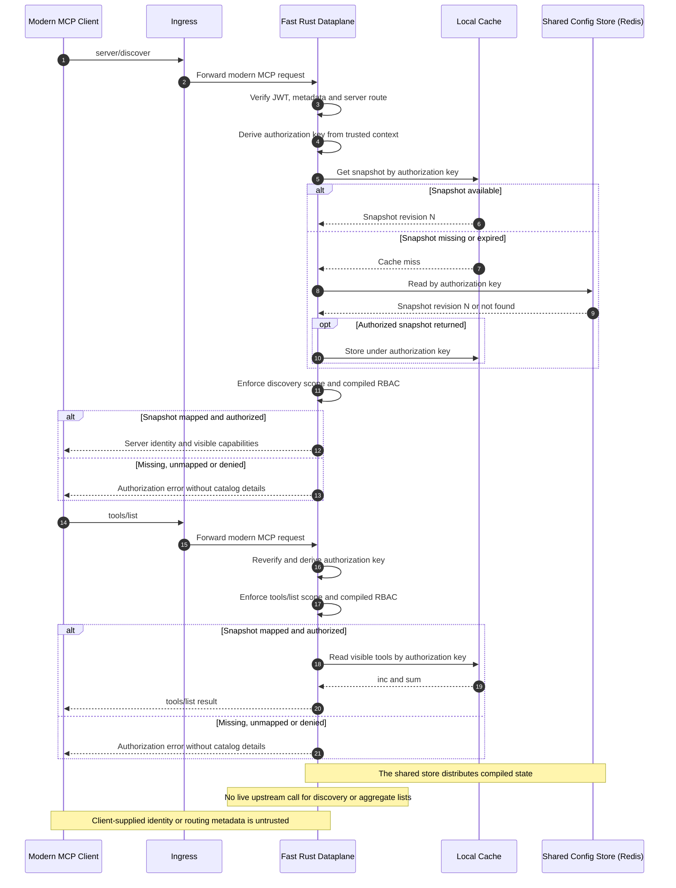
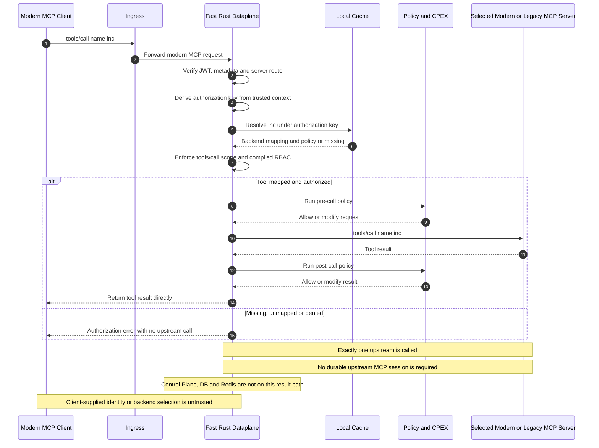
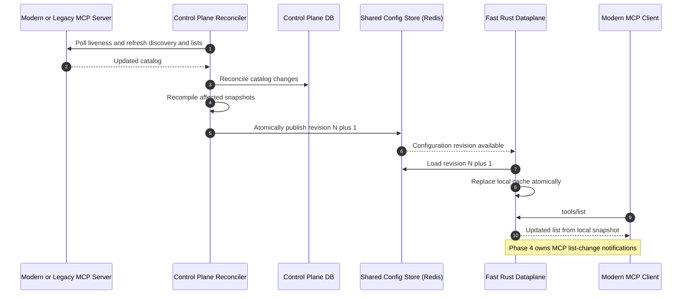

# ContextForge 2.0 Target Architecture and Roadmap

> **Tentative target:** this page records the proposed ContextForge 2.0 end
> state and delivery phases. It is not a description of the current Rust
> implementation. See [Architecture](architecture.md) and
> [MCP Routing Semantics](routing.md) for current behavior.

This is a product-wide view because the Rust dataplane boundary depends on
work owned by the external Python control plane and slow dataplane. It does not
move control-plane responsibilities into this repository.

## Vision and Constraints

- ContextForge as a product supports modern MCP `2026-07-28` and legacy MCP
  `2025-11-25` and older. Streamable HTTP is the preferred transport.
- The fast Rust dataplane accepts only modern MCP `2026-07-28` downstream
  traffic. Legacy downstream clients stay on the Python slow path.
- The control plane and both dataplanes may connect to modern or legacy
  upstream MCP servers using the protocol and transport appropriate to each
  server.
- Legacy upstream session handling is best effort. The target request path
  does not depend on a durable MCP session between ContextForge and an upstream
  server.
- Fan-out and other one-to-many MCP work is limited to the control plane. The
  slow and fast dataplanes generate discovery, capability, and list responses
  from control-plane-authored effective configuration.
- Effective configuration flows one way from the control plane to the
  dataplanes through externally shared state. A process-local cache may speed
  reads but is never the source of truth.
- MCP subscriptions and notifications remain Phase 4 work.

## Target End State

The front door uses route and protocol metadata to split management, legacy
MCP, and modern MCP traffic. PostgreSQL remains the durable management store;
the shared runtime store carries compiled configuration to both dataplanes.

The preferred end state is for both dataplanes to consume the same compiled
configuration. Redis is the current fast-path store and the preferred shared
implementation. During the Python migration, the slow path may instead read
shared Redis or PostgreSQL state. It must not rely on process memory alone when
multiple slow-path instances are deployed.

## Component Responsibilities

| Component | Target responsibility |
| --- | --- |
| Front door | Route management APIs to the control plane, legacy MCP to the slow path, and modern `2026-07-28` Streamable HTTP MCP to the fast path. |
| Admin and management API | Manage the virtual-server lifecycle and upstream assignments; connect to heterogeneous upstreams; retrieve and page through capabilities, tools, resources, prompts, completions, and other catalogs; normalize and persist them; let administrators select exposed objects and rules; compile effective runtime configuration; poll upstream liveness and changes. |
| PostgreSQL | Persist administrative source data such as virtual servers, upstream definitions, normalized catalogs, selections, and policies. It is not on the fast request path. |
| Configuration synchronization | Publish effective configuration one way from the control plane to externally shared state. Both dataplanes should consume the same shape where practical. |
| Slow path MCP dataplane | Handle modern and legacy downstream protocols during the Python transition; remain the legacy path after modern traffic moves to Rust. Read effective configuration from shared state and generate aggregate responses without live upstream fan-out. |
| Fast Rust MCP dataplane | Handle modern downstream MCP efficiently. Read effective configuration, serve aggregate responses locally, and route a targeted method to exactly one selected modern or legacy upstream. It does not own IAM, UI, management APIs, or durable metrics storage. |
| Upstream MCP servers | May use modern or legacy MCP. Legacy upstream sessions are best effort; the architecture does not require durable upstream session affinity. |

## Administrative State and Effective Configuration

The control plane owns two distinct forms of state:

| State | Contents | Owner and consumers |
| --- | --- | --- |
| Administrative source state | Virtual servers, upstream registrations, raw and normalized catalogs, exposure selections, policies, and liveness. | Written by the control plane to PostgreSQL; used by management workflows and reconciliation. |
| Effective runtime configuration | Effective server identity and capabilities, visible tools/resources/prompts/completions, downstream paging material, backend resolution, required scopes/roles, and applicable runtime policy for a tenant or isolation domain, user, team, or other principal. | Compiled and published by the control plane; read by slow and fast dataplanes. |

The control plane must exhaust upstream pagination while reconciling catalogs.
The compiled snapshot must contain enough information for either dataplane to
produce downstream paging without contacting every upstream. Publication must
be atomic or revisioned so a dataplane never combines partial catalog and
policy state.

## Target Authorization Invariants

The effective-configuration model requires identity isolation as well as
catalog precomputation. A cached snapshot is data, not an authorization grant.
Every downstream request must independently establish and enforce its trusted
authorization context.

- The dataplane derives the authorization key only from verified JWT claims
  and the validated server route. MCP params and client metadata must not
  supply or override a principal, team, tenant, virtual server, backend, or
  cache key.
- Snapshot and cache partitions include the applicable trust or tenant
  boundary, authenticated `sub`, effective team or other principal, virtual
  server, and configuration revision. Entries must never be reused across
  authorization contexts.
- The control plane maps verified identity attributes to an effective
  principal and compiles its visible objects and RBAC policy. The dataplane
  enforces required token scopes or roles and the compiled policy on every
  discovery, list, and targeted operation.
- Missing, unmapped, ambiguous, expired, or unauthorized snapshots and objects
  are denied by default. A targeted denial makes no upstream call, and errors
  must not disclose another principal's catalog or backend mapping.
- The exact tenant/team claim mapping and token-scope-to-RBAC rules are a
  cross-repository contract that the control plane, publisher, schemas,
  dataplane, and integration tests must define together. The current coarse
  `sub`-only implementation is not the Phase 3 target.

## MCP Work Allocation

| Work | Target owner and behavior |
| --- | --- |
| Virtual-server creation and upstream assignment | Control plane persists management state and connects to assigned upstreams. |
| Upstream discovery, initialization where required, catalog pagination, capability aggregation, filtering, and liveness polling | Control plane only; this is the intentional fan-out boundary. |
| Modern downstream `server/discover` and effective capabilities | After per-request authorization, the fast dataplane generates the response from the principal-bound effective configuration. Legacy initialization remains on the slow path. |
| `tools/list`, `resources/list`, `prompts/list`, resource-template listing, and similar aggregate methods | After method-scope and compiled-RBAC enforcement, the slow or fast dataplane generates the visible response from principal-bound effective configuration with no live upstream fan-out. |
| `tools/call`, `resources/read`, `prompts/get`, completion, and similar targeted methods | Dataplane resolves the effective entry under the trusted authorization key, applies default-deny scope and object policy, and calls exactly one selected upstream only when authorized. |
| Plugins for trusted aggregate responses | Prefer policy compiled by the control plane; avoid mandatory per-request plugin calls for a response already produced from trusted effective configuration. |
| Plugins for targeted calls | May run on the fast path when request or response inspection is required. Exact hook allocation remains an implementation decision. |
| Subscriptions, server notifications, and downstream list-change notifications | Deferred to Phase 4 because their state and delivery model do not fit the request/response simplification. |

## Delivery Roadmap

| Phase | Scope |
| --- | --- |
| **1. Separate the Python control and slow planes** | Establish a clear boundary inside the current Python component. The control plane writes effective configuration per user, team, or other principal to shared state; the slow dataplane reads it and responds accordingly. Slow-path paging may be deferred or skipped if the fast-path migration progresses quickly. Plugins that belong on the fast path need not be duplicated in the slow path. |
| **2. Offload targeted calls to the fast dataplane** | Make the slow and fast dataplanes follow the same configuration-driven pattern. Initially send only targeted operations such as `tools/call`, `resources/read`, `prompts/get`, and completion to the fast dataplane. |
| **3. Offload all request/response MCP methods to the fast dataplane** | Serve modern discovery, capabilities, aggregate lists, and targeted calls correctly from the fast dataplane. Aggregate responses come from effective configuration; targeted calls reach exactly one upstream. |
| **4. Implement subscriptions and notifications** | Add the state, routing, and delivery model for upstream subscriptions, resource notifications, and list-change notifications after the request/response architecture is complete. |

## Phase 3 Reference Flows

The examples below use tools, but the same ownership applies to resources,
prompts, completions, and other aggregate or targeted request/response methods.

### 1. Create a Virtual Server and Select Capabilities

### 2. Discover the Server and List Tools

### 3. Call a Tool

### 4. Reconcile an Upstream Catalog Change

