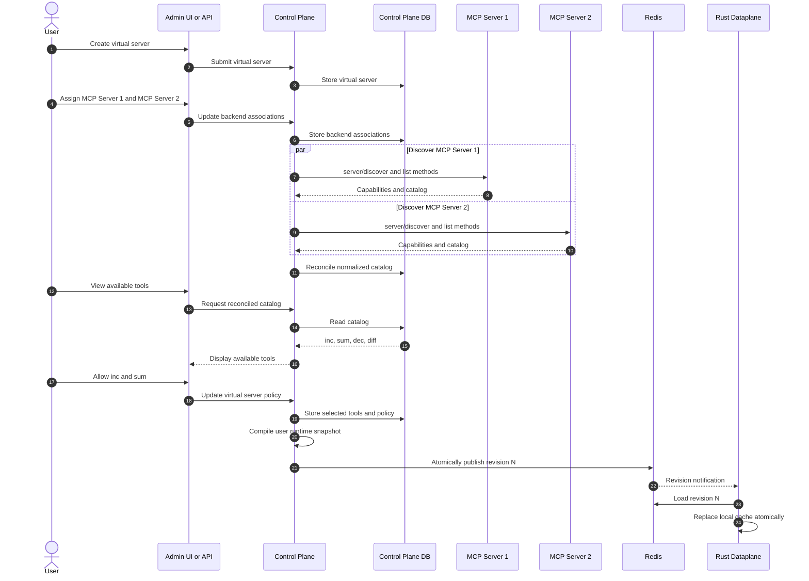
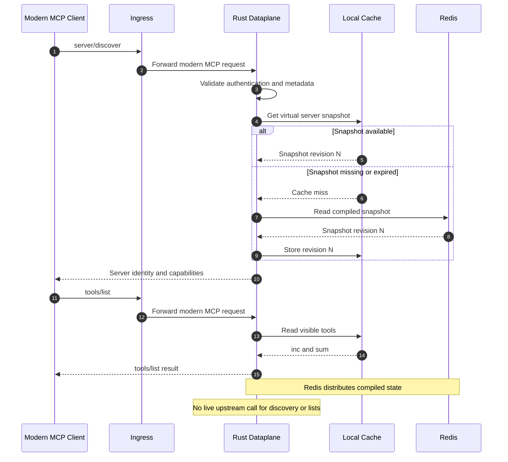
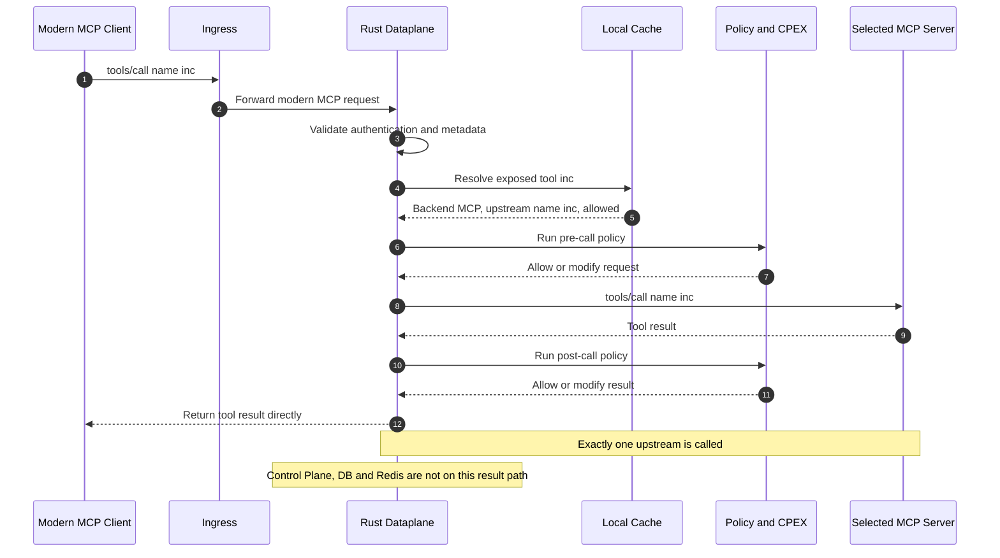
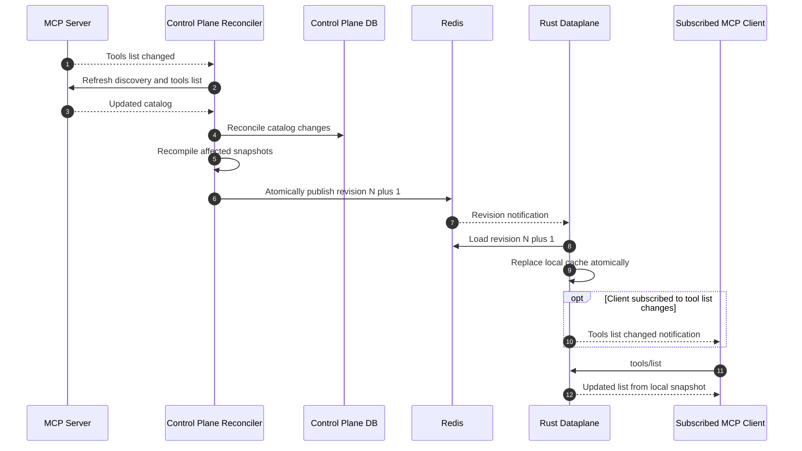

# MCP Capability Allocation

This table assigns the
[MCP 2026-07-28](https://modelcontextprotocol.io/specification/2026-07-28)
protocol surfaces across the ContextForge control plane, dataplane, upstream
backends, and MCP host.

The control plane owns descriptive and durable control state, upstream catalog
reconciliation, policy, and runtime snapshot compilation. The dataplane handles
all live modern MCP client requests. It serves discovery and list methods from
the published snapshot and routes targeted operations to one upstream backend.
Upstream backends remain authoritative for backend-created durable state, while
the MCP host owns user interaction and MCP App rendering.

`Essential` identifies the initial scope. Advanced capabilities remain `TBD`;
their recommended allocation records the intended direction without committing
them to the initial implementation.

| MCP surface | Authority and delivery | Status | Recommended behavior |
| --- | --- | --- | --- |
| `server/discover` | Control plane content; dataplane delivery | Essential | The control plane compiles the merged logical-server identity, instructions, capabilities, extensions, TTL, and cache scope. The dataplane serves the live request from the published snapshot. |
| `tools/list` | Control plane catalog; dataplane delivery | Essential | The control plane materializes and policy-filters the catalog. The dataplane serves stable names and pagination from the snapshot without synchronous upstream fanout. |
| `tools/call` | Dataplane | Essential | Route one target, validate input and output, execute plugins, stream progress, and propagate cancellation and multi-round-trip requests (MRTR). |
| `resources/list` | Control plane catalog; dataplane delivery | Essential | The control plane catalogs and policy-filters resources. The dataplane serves the deterministic snapshot. |
| `resources/templates/list` | Control plane catalog; dataplane delivery | Essential | The control plane catalogs URI templates and metadata. The dataplane serves the live request from the snapshot. |
| `resources/read` | Dataplane | Essential | Route and stream potentially large, dynamic, or private content on the hot path. |
| `prompts/list` | Control plane catalog; dataplane delivery | Essential | The control plane catalogs and policy-filters prompt definitions. The dataplane serves the live request from the snapshot. |
| `prompts/get` | Dataplane | Essential | Render prompts that may be dynamic, expensive, private, or require MRTR. |
| `completion/complete` | Dataplane | Essential | Route interactive, latency-sensitive completion requests using control-plane mappings. |
| `subscriptions/listen` | Dataplane | TBD | Maintain long-lived streams and multiplex upstream notifications. |
| List-change events | Control plane to dataplane | TBD | Generate normalized catalog invalidations in the control plane and deliver them through active dataplane subscriptions. |
| Resource subscriptions | Dataplane | TBD | Subscribe upstream and relay content-change notifications without durable subscription state. |
| Progress and cancellation | Dataplane | TBD | Keep progress on the originating response stream and immediately propagate cancellation upstream. |
| MRTR | Dataplane and MCP host | TBD | Transparently carry `InputRequiredResult`, `requestState`, and retry responses in the dataplane; perform user or model interaction in the host. |
| Tasks | Dataplane routing; backend state | TBD | Route `tasks/get`, `tasks/update`, and `tasks/cancel`; keep durable task state in the originating backend. The control plane owns enablement and policy. |
| OAuth and OIDC endpoints | Control plane | TBD | Own authorization-server discovery, login, consent, registration, token issuance, refresh, and step-up. |
| Access-token enforcement | Dataplane | TBD | Verify signature, expiry, audience, scope, and resource policy on every request. Never forward a downstream bearer token upstream. |
| MCP Apps metadata and assets | Control plane | TBD | Validate and version app manifests, UI assets, CSP, permissions, tool visibility, and origin-server associations. |
| MCP Apps asset delivery and calls | Dataplane | TBD | Serve `ui://` resources and route app-originated tool calls without executing UI HTML. |
| MCP Apps iframe and UI | MCP host | TBD | Own iframe sandboxing, CSP enforcement, `postMessage`, `ui/initialize`, permission prompts, and user consent. |
| Pagination | Control plane snapshot; dataplane delivery | TBD | The control plane produces a stable ordered snapshot. The dataplane owns the client-facing cursor over that snapshot. |
| Caching | Split | TBD | Materialize discovery and lists in the control plane and cache the published snapshot locally in the dataplane. Cache targeted resource reads only when authorization and `cacheScope` permit it. |
| Stdio adapters | Connector or control-plane tier | TBD | Keep process lifecycle and local adapter management out of the Rust dataplane. |
| Deprecated and legacy MCP | Control plane only | TBD | Do not add legacy sessions, SSE, Roots, Sampling, or Logging to the modern dataplane. |

## Upcoming Architecture (Tentative)

> **Proposed direction, not an approved final design.** These sequences are
> intended to make the control-plane/dataplane boundary concrete enough for
> review. Details such as snapshot shape, invalidation transport, failure
> policy, cache lifetime, and notification behavior may change.

The central proposal is:

- the control plane performs management-time upstream discovery, persists the
  catalog and policy, and publishes versioned runtime snapshots;
- the dataplane terminates every live modern MCP client request;
- discovery and list requests are answered from the published snapshot;
- targeted requests such as `tools/call` go directly from the dataplane to one
  upstream MCP server; and
- Redis distributes state and invalidations. It is not an RPC or result bus.

### 1. Create a Virtual Server and Select Capabilities

### 2. Discover the Server and List Tools

### 3. Call a Tool

### 4. Reconcile an Upstream Catalog Change

