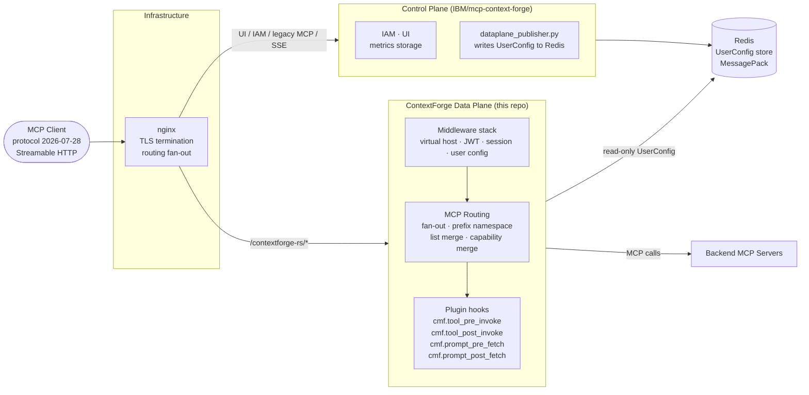
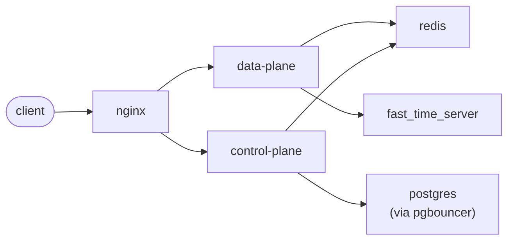

# Project Overview

> This page describes the **current implementation**. The tentative product
> end state and Phase 1-4 migration are documented in
> [ContextForge 2.0 Target Architecture and Roadmap](mcp-capability-allocation.md).

## What this project is

`contextforge-data-plane` is a Rust-based MCP (Model Context Protocol) gateway — the **dataplane** component of ContextForge. It acts as a scalable, secure proxy layer that routes AI tool calls from MCP clients to one or more backend MCP servers.

It is paired with the external ContextForge control plane at [`IBM/mcp-context-forge`](https://github.com/IBM/mcp-context-forge). The two components have a strict division of responsibility:

| Layer | Owns today |
| --- | --- |
| **This repo (dataplane)** | Request routing, auth enforcement, backend fan-out, session ownership |
| **Control plane** | IAM, UI, metrics storage, legacy MCP client compatibility |

The dataplane must never take on control-plane concerns.




## Goals and objectives

- Provide a **production-grade, low-latency routing layer** between MCP clients and backend MCP servers.
- Support MCP `2026-07-28` and `2025-11-25` over Streamable HTTP as stateless downstream contracts.
- Enforce a clean **dataplane/control-plane boundary** — no IAM, UI, or metrics storage logic in this repo.
- Keep config access behind the **`UserConfigStore` abstraction** (backed by Redis/MessagePack).
- Remain in the right architectural shape during early development, prioritising correctness over backward compatibility.

## Key stakeholders and users

- **Platform teams** — deploy and operate the gateway as infrastructure.
- **AI application developers** — use the gateway as the MCP proxy layer for their applications.
- **Internal contributors** — engineers evolving the dataplane toward stateless `2026-07-28` and `2025-11-25` protocol support.

## Key modules and architecture

Architecture context lives in the wiki. Key pages:

| Wiki page | Covers |
| --- | --- |
| [architecture.md](architecture.md) | Crate layout, pipeline shape, state ownership, module boundaries |
| [routing.md](routing.md) | Backend prefix namespace, routing contract, session state, method reference |
| [mcp-capability-allocation.md](mcp-capability-allocation.md) | Tentative ContextForge 2.0 end state, responsibility allocation, and Phase 1-4 roadmap |
| [config.md](config.md) | JWT validation, config keying, UserConfig shape, cache behavior |
| [security.md](security.md) | Trust boundaries, invariants, and tradeoffs |

## Crate ownership

| Crate | Purpose |
| --- | --- |
| `contextforge-data-plane-lib` | All dataplane behavior: routing, middleware, sessions, transports. Almost everything goes here. |
| `contextforge-data-plane` (binary) | Process shell only: CLI flags, logging, runtime shape. No dataplane logic. |
| `contextforge-data-plane-apis` | Shared config shapes (`UserConfig`, `User`, plugin config). Regenerate JSON schemas after any change: `cargo run -p contextforge-data-plane-apis`. |
| `contextforge-data-plane-cpex` | Plugin integration (CPEX hook factories). |
| `contextforge-load-test` | Performance harness: end-to-end MCP traffic driver. |

**Key invariants:**
- Redis/config access goes through `UserConfigStore` only — never leak Redis details into routing code.
- The backend prefix naming contract must not change without updating merge logic, split logic, and tests.
- When behavior on the hot path changes, the matching wiki page must be updated in the same change.

## Active work (near-term)

- **Protocol migration**: support same-version `2026-07-28` and `2025-11-25` paths over Streamable HTTP, provide best-effort translation in either cross-version direction, and replace stateful session paths with request-scoped handling.
- Legacy SSE transport and session affinity are **being removed**. `initialize` is retained as a stateless compatibility request and must not create persistent dataplane or backend session state.
- Protocol-sensitive tests must cover the two direct and two best-effort cross-version combinations. Modern examples should continue to use `server/discover` and per-request client metadata; compatibility examples may use `initialize` without relying on later session reuse.

## Control-Plane Integration Contract

> **Provisional.** No formal contract has been stipulated yet. This section documents the current de-facto integration surface with [IBM/mcp-context-forge](https://github.com/IBM/mcp-context-forge). Any row may change while the project is early; when a proper contract is agreed, update this section to track it.

| Agreement | Value today |
| --- | --- |
| Client-facing route | `/servers/{virtual_host_id}/mcp`. Front door rewrites modern MCP `2026-07-28` Streamable HTTP traffic to `/contextforge-rs/servers/{virtual_host_id}/mcp` on the dataplane. |
| Protocol compatibility | Today the dataplane route accepts MCP `2026-07-28`; the control plane serves `2025-11-25`, session-based initialization, and SSE on its own routes. The target moves both supported Streamable HTTP versions to stateless dataplane handling, with cross-version adaptation on a best-effort basis. |
| Unknown virtual host | `404` with body `{"detail":"Server not found"}`, matching the control-plane response shape. |
| Token issuer and audience | `iss = mcpgateway`, `aud = mcpgateway-api`. |
| Claims shape | `sub`, `jti`, `iss`, `aud`, `exp`, and `user` required. `token_use`, `iat`, `teams`, `scopes`, and `user.full_name` optional. Dataplane routes on `sub` only. |
| User config Redis key | `MessagePack(User::new(jwt_subject))` — key type plus subject, not the raw subject string. |
| User config Redis value | `MessagePack(UserConfig)`. JSON schema at `schemas/user_config.json`. |
| User key Redis schema | `schemas/user.json`. |
| Plugin config key | `ContextForgeGatewayRuntimePluginConfig`, JSON or MessagePack, `version: 1` with a `cpex` section. |

**Coordination rule:** changing any row above is a cross-repo change. The dataplane, the control-plane publisher (`dataplane_publisher.py`), and the `cf-integration` harness all need updating together.

Regenerate both schemas after any struct change to `UserConfig`, `VirtualHost`, `BackendMCPGateway`, or the `User` key type:
```bash
cargo run -p contextforge-data-plane-apis
```

## System topology (current)

All external traffic enters through **nginx**, which fans out to either the dataplane or the control plane:



### How the control plane publishes config to the dataplane

The control plane and dataplane do **not** communicate over HTTP. Config is exchanged exclusively through Redis:

1. The control plane runs **`dataplane_publisher.py`** — a publisher script that writes dataplane configuration (user config, backend definitions, etc.) into Redis.
2. The dataplane reads that config from Redis via the **`UserConfigStore`** abstraction (MessagePack-encoded `UserConfig`).

This means:
- The dataplane is a **pure reader** of Redis config. It never writes back to the control-plane's Redis keys.
- The control plane is the **sole writer** of dataplane config; the dataplane has no direct dependency on the control-plane process at runtime.
- Config changes from the control plane are picked up by the dataplane through normal cache refresh / Redis reads — no restart or direct RPC required.

### Per-component responsibilities

| Component | Role | Persistence |
| --- | --- | --- |
| **nginx** | TLS termination, routing fan-out | — |
| **dataplane** (`contextforge-data-plane`) | MCP routing, auth enforcement, fan-out to backends | Redis (read-only for config) |
| **control-plane** (`IBM/mcp-context-forge`) | IAM, UI, metrics, legacy MCP clients, config publishing | Redis (write) + PostgreSQL (via pgbouncer) |
| **redis** | Runtime config store, inter-component pub/sub channel | In-memory + persistence |
| **postgres** (via pgbouncer) | Control-plane relational store | Durable |
| **fast_time_server** | High-resolution time source used by the dataplane | — |

## External dependencies and integration points

- **Redis** — runtime config store (MessagePack-encoded `UserConfig`). Populated by `dataplane_publisher.py` on the control plane; read by the dataplane via `UserConfigStore`.
- **Control plane** (`IBM/mcp-context-forge`) — owns legacy MCP client routes and publishes dataplane config via `dataplane_publisher.py`. Does not route through this dataplane at runtime.
- **fast_time_server** — high-resolution time source consumed by the dataplane.
- **Tokio + Axum** — fixed async runtime and web framework.
