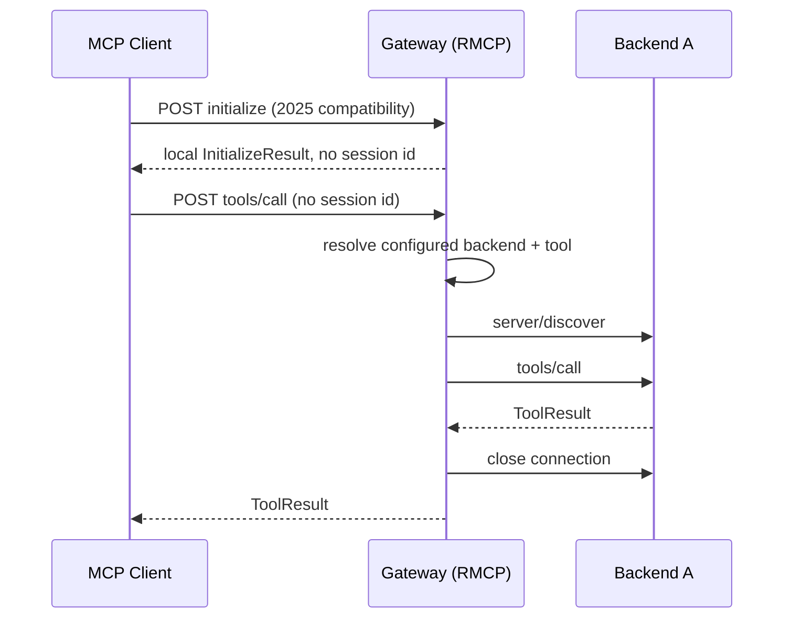

# MCP Routing Semantics

> This page describes the **current stateless routing behavior**.
> See [ContextForge 2.0 Target Architecture and Roadmap](mcp-capability-allocation.md)
> for the proposed ownership boundary and migration.

## Backend Prefix Contract

Backend map keys become public identifiers only for **multi-backend virtual hosts without an explicit tool alias**:

```text
backend tool "increment" on backend "gateway-one" → "gateway-one-increment"
backend resource "counter" on backend "gateway-one" → "gateway-one-counter"
```

Single-backend virtual hosts: identifiers pass through **unchanged**.

> **Breaking change rule:** changing a backend map key changes downstream identifiers for multi-backend virtual hosts. Do not rename without updating merge logic, split logic, and tests.

## Tool Aliases

`BackendMCPGateway.tool_name_aliases` maps `{downstream_alias: upstream_original}`. Aliases take precedence over prefix fallback. They are advertised and routed exactly as published (case, dots, underscores preserved).

## List Operations

All four list methods are rejected locally and remain control-plane responsibilities:

```text
list_tools / list_resources / list_prompts / list_resource_templates
  → INVALID_REQUEST: use the control plane
```

Aliases and legacy prefixes remain usable for targeted calls published by the control plane.

## Routed Operations (single backend)

Calls targeting one object use the inverse rule. The name splitter walks configured backend names and requires a `-` immediately after the backend name:

```text
gateway-one-increment  →  backend: gateway-one,  tool: increment
gateway-oneincrement   →  rejected (no - separator)
```

`call_tool` resolves explicit alias first, then falls back to single/multi-backend logic.

Methods using the same conditional routing: `read_resource`, `subscribe`, `unsubscribe`, `get_prompt`, `complete`.

## Stateless Request Lifecycle

The dataplane uses RMCP's `NeverSessionManager` and disables legacy session mode. It never issues or requires `Mcp-Session-Id`, and it retains no backend transport between downstream requests. Legacy `initialize` remains a local compatibility response only; each later request independently resolves configuration and opens its own backend connection.





## MCP Method Quick Reference

| Method | Group | Behavior |
| --- | --- | --- |
| `initialize` | Compatibility | For `2025-11-25`, returns a local stateless compatibility result with no session id; modern clients use `server/discover`. |
| `list_tools` / `list_resources` / `list_prompts` / `list_resource_templates` | List | Rejected locally; use the control plane. |
| `call_tool` | Targeted | Resolves the upstream name, creates a per-request backend connection, runs pre/post hooks, executes, and closes. Forwards cancellation and request-scoped progress. |
| `read_resource` | Targeted | Resolves alias/prefix, creates a per-request backend connection, executes, and closes. |
| `subscribe` / `unsubscribe` | Unsupported | Rejected locally; use the control plane. |
| `get_prompt` | Targeted | Resolves alias/prefix and runs pre/post prompt hooks around a per-request backend call. |
| `complete` | Unsupported | Rejected locally; use the control plane. |
| `ping` | Local | Returns success; no backend fanout. |
