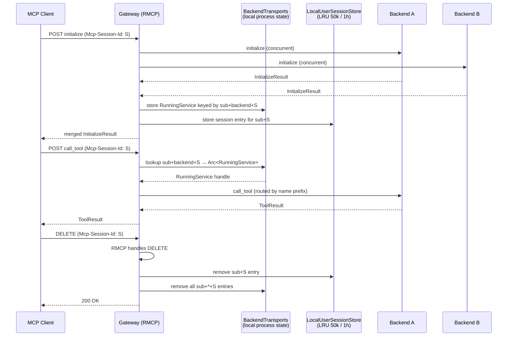

# MCP Routing Semantics

> This page describes the **current transitional routing behavior**. Its live
> upstream fan-out and durable-session assumptions are not the Phase 3 target.
> See [ContextForge 2.0 Target Architecture and Roadmap](mcp-capability-allocation.md)
> for the proposed ownership boundary and migration.

## Backend Prefix Contract

Backend map keys become public identifiers only for **multi-backend virtual hosts without an explicit tool alias**:

```text
backend tool "increment" on backend "gateway-one" → "gateway-one-increment"
backend resource "counter" on backend "gateway-one" → "gateway-one-counter"
```

Single-backend virtual hosts: identifiers pass through **unchanged**.

> **Breaking change rule:** changing a backend map key changes downstream identifiers for multi-backend virtual hosts. Do not rename without updating merge logic, split logic, and tests.

## Tool Aliases

`BackendMCPGateway.tool_name_aliases` maps `{downstream_alias: upstream_original}`. Aliases take precedence over prefix fallback. They are advertised and routed exactly as published (case, dots, underscores preserved).

## List Operations (fan-out)

All four list methods fan out to all connected backends concurrently and merge results:

```text
list_tools / list_resources / list_prompts / list_resource_templates
  → all connected backends → merged sorted output
```

Failed/unavailable backends are logged and skipped. Single-backend: identifiers unchanged. Multi-backend: prefixed with backend map key.

## Routed Operations (single backend)

Calls targeting one object use the inverse rule. The name splitter walks configured backend names and requires a `-` immediately after the backend name:

```text
gateway-one-increment  →  backend: gateway-one,  tool: increment
gateway-oneincrement   →  rejected (no - separator)
```

`call_tool` resolves explicit alias first, then falls back to single/multi-backend logic.

Methods using the same conditional routing: `read_resource`, `subscribe`, `unsubscribe`, `get_prompt`, `complete`.

## Federated Pagination

The gateway wraps per-backend cursors inside its own opaque token (JSON, treated as opaque by MCP clients). First request: all backends queried. Resume: cursor decoded, exhausted backends skipped. New cursor emitted when any backend has more pages.

**Known limitation:** if backend set changes between pages, removed backend's cursor is silently dropped.

## Session State (local process)

Backend RMCP services are stored in `BackendTransports` keyed by:
```text
principal (claims.sub) + backend_name (map key) + downstream_session_id
```

This is **local process state only**. Implications:
- After `initialize`, later requests must reach the same process.
- Sticky routing required for load-balanced deployments.
- Gateway restart → all sessions lost → clients must re-run `initialize`.
- Multi-runtime mode (`--single-runtime false`): each runtime thread has its own `BackendTransports` with no cross-thread affinity.




## Capability Merge

On `initialize`, the gateway builds one downstream `InitializeResult` — not a passthrough of any one backend. The source of truth is each backend's `InitializeResult`; the gateway reads `peer_info().capabilities` from each running service and stores them with the backend transport state.

The merge rule (gateway-aware, not a raw union):
- Enable a top-level capability when ≥1 backend supports it **and** the gateway has a routing story for it.
- `resources.subscribe` preserved if any backend advertises it (the gateway routes subscribe/unsubscribe and forwards resource-update notifications).
- `listChanged` not yet advertised (gateway doesn't emit downstream list-changed notifications when upstream lists change).
- Single-backend passthrough is not a stable contract (`HashMap` iteration order).
- If no backend reports supported capabilities, returns `ServerCapabilities::default()`.

**Do not** initialize the downstream capability from just one backend entry — the gateway fronts multiple backends, `HashMap` iteration is non-deterministic, and list methods already merge across all backends.

## Cleanup

`DELETE` with `Mcp-session-id`:
```text
→ RMCP handles request
→ on success: remove LocalUserSessionStore entry + BackendTransports entries for principal+session
```
If RMCP rejects the delete, local state is untouched.


## MCP Method Quick Reference

| Method | Group | Behavior |
| --- | --- | --- |
| `initialize` | Session | Concurrent fanout to all backends; failure of one backend is non-fatal (stored with no service). Returns merged capability set. Requires `DownstreamSessionId`, `UserConfig`, `VirtualHostId`, `ContextForgeClaims`. |
| `list_tools` | List | Fan-out all connected backends → merged sorted result. Cursor-based pagination across backends. |
| `list_resources` | List | Same as list_tools. |
| `list_prompts` | List | Same as list_tools. |
| `list_resource_templates` | List | Same — both name and URI template get prefixed for multi-backend. |
| `call_tool` | Targeted | Resolves alias → single/multi-backend fallback. Runs pre/post plugin hooks. Forwards downstream cancellation to backend. Tracks backend progress tokens: RMCP assigns a new token per backend request; the gateway maps each backend token to the downstream token. Request enqueue and mapping publication are serialized against progress lookup so an immediate backend notification cannot overtake registration. When the notification matches an in-flight token, the gateway restores the downstream token and forwards it to the client. |
| `read_resource` | Targeted | Single-backend: URI unchanged. Multi-backend: strips prefix. |
| `subscribe` / `unsubscribe` | Targeted | Same resource-URI routing; forwards/stops resource-update notifications. |
| `get_prompt` | Targeted | Single-backend: name unchanged. Multi-backend: strips prefix. Runs pre/post prompt hooks around the backend call: the pre hook may rewrite arguments or deny, the post hook may rewrite or reject the rendered messages. |
| `complete` | Targeted | Routes on prompt name or resource URI inside `ref`. |
| `ping` | Local | Returns success; no backend fanout. |
| `DELETE` | Session | RMCP handles first; on success `session_id_layer` removes local session + backend transports. |
