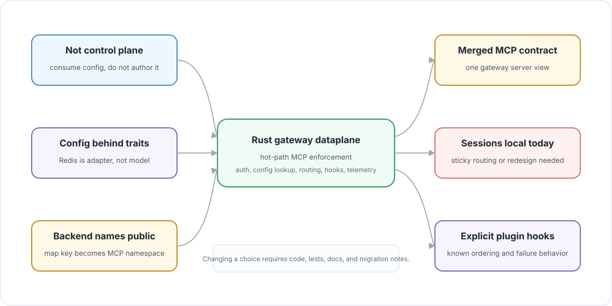

# Architectural Choices

> 🧱 **Design rule:** these choices are not permanent, but changing one should
> be a deliberate architecture decision with code, tests, and migration notes.



This page records the choices that should stay visible as the gateway evolves.
They describe the shape of the current Rust dataplane, not just preferences.

## Choice Matrix

| Choice | Current decision | Why it matters |
| --- | --- | --- |
| Dataplane, not control plane | This repo consumes runtime config and handles traffic. It does not own UI, IAM lifecycle, management APIs, or durable observability storage. | Keeps the hot path small and prevents product workflows from leaking into request routing. |
| Modern downstream MCP only | The target dataplane contract is MCP `2026-07-28` over Streamable HTTP. The control plane serves older versions and SSE without routing them through the dataplane. | Keeps legacy negotiation and transport compatibility out of the hot dataplane. |
| Config access is abstracted | MCP routing depends on `UserConfig`, `VirtualHost`, and `UserConfigStore`, not Redis commands. | Keeps future xDS/gRPC or another config stream possible. |
| Backend names are public | The backend map key is part of tool/resource/prompt names. | Backend renames are client-visible behavior changes. |
| Sessions are local today | Backend RMCP services live in `BackendTransports` inside one process. | Load-balanced deployments need sticky routing or a new session ownership design. |
| Merged MCP semantics define the contract | The client sees one gateway MCP server with namespaced backend objects. | Backend topology should not become a hard client dependency beyond the namespace contract. |
| Plugin boundaries stay explicit | Tool and prompt pre/post hooks are integrated at known points around backend invocation. | Payload mutation needs clear failure, timeout, cancellation, and telemetry behavior. |

## Dataplane, Not Control Plane

The gateway should enforce decisions already made elsewhere:

```text
control plane authors config and policy
  -> Redis/config transport exposes runtime data
  -> Rust dataplane enforces it on MCP traffic
```

New features should start with one question:

```text
Is this hot-path enforcement, or is this a management workflow?
```

If it is a workflow, it probably belongs outside this repo. The Rust gateway
should enforce the result of management decisions, not become the place where
those decisions are authored.

## Modern Downstream MCP Only

The dataplane is moving to one downstream protocol contract:

```text
MCP 2026-07-28
  -> Streamable HTTP
  -> server/discover
  -> required per-request client context
```

The Rust gateway should not grow adapters for older MCP versions, legacy
session initialization, or SSE. The external control plane serves those
clients on control-plane routes. Legacy traffic does not enter the dataplane;
only clients using the modern contract are routed here.

Some current code and diagrams still describe session-oriented implementation
details. Treat them as migration inventory. Replace them with the modern
protocol path rather than preserving them as public compatibility behavior.

## Config Access Is Abstracted

Redis is the current storage and transport adapter. It is not the routing
model. The routing model is:

```text
UserConfig
  -> VirtualHost
  -> BackendMCPGateway
```

That is why request code should stay behind `UserConfigStore`. Redis key
encoding, MessagePack, cache expiry, and retry settings belong in the adapter,
not in MCP method handling.

## Backend Names Are Conditionally Public

Backend map keys are visible in the MCP namespace when multiple backends need
disambiguation:

```text
backend map key: gateway-one
backend tool: increment
gateway tool: gateway-one-increment
```

For a single backend, upstream identifiers pass through unchanged. Explicit
`tool_name_aliases` published by the control plane take precedence in either
case. Otherwise the map key, not `BackendMCPGateway.name`, is the namespace
used by multi-backend routing.

## Session State Is Local Today

Backend services are not just data. They are live RMCP running services stored
under:

```text
principal + backend_name + downstream_session_id
```

That makes the current state model fast and direct, but not horizontally
portable. Do not design request handling as if every node can serve every
stateful MCP session until backend service ownership has an external owner or
can be rebuilt safely.

## Merged MCP Semantics Define The Contract

The downstream client should reason about one MCP server:

```text
client
  -> ContextForge Data Plane
  -> merged tools/resources/prompts
```

Backend identity appears only when namespacing is needed, and clients should
not need to know transport details, Redis storage, fanout mechanics, or plugin
runtime internals.

This choice leaves room for filtering, policy, and route changes without
turning every backend topology change into a client integration change.

## Plugin Boundaries Stay Explicit

Plugins can inspect or mutate payloads. That is more powerful than a header
filter, so the hook points need to stay obvious.

Current CPEX support is intentionally narrow:

| Hook | Current boundary |
| --- | --- |
| `TOOL_PRE_INVOKE` | Runs before `call_tool` forwards to the selected backend. |
| `TOOL_POST_INVOKE` | Runs after `call_tool` receives a backend result and on backend progress events. |

Avoid adding ad hoc plugin calls in the middle of routing code. If a new hook
is needed, define its ownership, failure behavior, timeout behavior,
cancellation behavior, streaming behavior, and telemetry attribution.

## Transport Security Is Split

Downstream TLS is listener-level process config. Upstream backend security is
also process config today, but some of it is naturally backend-specific.

Keep this split visible:

| Concern | Stable owner |
| --- | --- |
| Gateway listener certificate | Process config. |
| JWT verification keys | Process config. |
| Backend URL, auth headers, pass-through policy, allowed objects | Runtime user config. |
| Backend-specific trust and client identity | Likely runtime config or referenced secret material over time. |

The gateway should not bury transport security decisions inside MCP method
handlers. They should remain either startup assembly or explicit backend
transport construction.

## MCP-First, Not MCP-Only

The current code implements MCP behavior, but the shell is broader:

```text
auth
config lookup
transport setup
plugin runtime
telemetry
session strategy
```

Keep protocol-neutral concerns reusable. Future A2A or model-provider routing
should be able to reuse the gateway shell without copying the MCP routing
stack.

## When A Choice Changes

Changing one of these choices should update more than one file.

| Change | Expected follow-through |
| --- | --- |
| Downstream MCP version changes | Coordinate with the control plane, update modern protocol tests and examples, and keep legacy traffic on control-plane routes. |
| Backend namespace changes | Update merge logic, split logic, tests, docs, and migration notes. |
| Session state moves external | Update `SessionManager`, cleanup behavior, load-balancing docs, and failure-mode tests. |
| Config transport changes | Keep `UserConfigStore` as the boundary and update adapter tests. |
| Plugin hook surface expands | Document ordering, failure behavior, cancellation, streaming, and telemetry. |
| New protocol joins the gateway | Keep shared shell code protocol-neutral and isolate protocol-specific routing. |

These pages are part of that safety net: they make architecture drift visible
before it becomes accidental API behavior.
