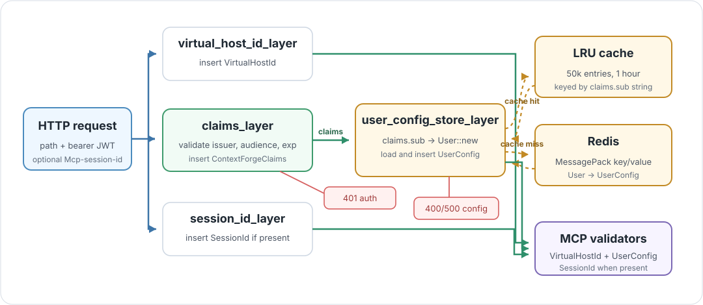

# Authentication And User Config Lookup

> 🔐 **Boundary:** authentication proves who is calling. User config lookup
> decides which virtual hosts and backends that caller can reach.



This page follows the identity boundary in the request path. The gateway does
not let an MCP method choose arbitrary backend URLs. It validates the bearer
token, loads the caller's `UserConfig`, and only then lets MCP validators select
a virtual host from that config.

## Request Order

Authentication and config lookup happen before `McpService` handles the MCP
method:

| Step | Code | Output |
| --- | --- | --- |
| Path context | `virtual_host_id_layer` | `VirtualHostId` extension. |
| JWT validation | `claims_layer` | `ContextForgeClaims` extension. |
| Session header | `session_id_layer` | Optional `SessionId` extension. |
| Config lookup | `user_config_store_layer` | `UserConfig` extension. |
| Virtual host check | `virtual_host_config_layer` | `404` when the path's virtual host id is not in the loaded config. |
| MCP validation | `InitializeCallValidator` or `AuthorizedCallValidator` | Selected `VirtualHost`, session id, and claims. |

The order matters: `user_config_store_layer` needs `ContextForgeClaims`, and MCP
validators need both `UserConfig` and `VirtualHostId`.

## Token Validation

`claims_layer` reads `Authorization: Bearer ...` and decodes the JWT with the
algorithm declared in the JWT header.

| Token property | Current behavior |
| --- | --- |
| Algorithm | Accepts RS256/RS384/RS512 when an RSA public key is configured, or HS256/HS384/HS512 when a shared secret is configured. |
| Issuer | Must match `mcpgateway`. |
| Audience | Must match `mcpgateway-api`. |
| Expiration | `exp` is validated. |
| Unsupported algorithm | Rejected before claims are inserted. |

The decoded value is stored as `ContextForgeClaims`. The fields currently
important to routing are:

| Claim | Routing role |
| --- | --- |
| `sub` | Becomes the user config key and the principal for backend session lookup. |
| `iss`, `aud`, `exp` | Authentication checks only. |
| `jti`, `token_use`, `iat`, `teams`, `user`, `scopes` | Carried in claims for future policy use; not currently used by MCP routing. `token_use`, `iat`, `teams`, and `scopes` are optional, as is `user.full_name`, so tokens without those fields still validate. |

A concrete decoded payload for the local `admin@example.com` subject looks like
this (timestamps shown as example Unix seconds). Of everything here, MCP routing
depends only on `sub` today. The optional fields are included for illustration:

```json
{
  "iss": "mcpgateway",
  "aud": "mcpgateway-api",
  "sub": "admin@example.com",
  "exp": 1717180800,
  "iat": 1717177200,
  "jti": "example-token",
  "token_use": "api",
  "teams": ["team_awesome"],
  "user": {
    "email": "admin@example.com",
    "full_name": "API Token User",
    "is_admin": true,
    "auth_provider": "api_token"
  },
  "scopes": {
    "server_id": "my_id",
    "permissions": ["tools.read", "servers.use"],
    "ip_restrictions": ["192.169.1.0/24"],
    "time_restrictions": null
  }
}
```

## User Config Key

`user_config_store_layer` turns the subject into a typed key:

```text
ContextForgeClaims.sub
  -> User::new(subject)
  -> UserConfigStore::get_config(&user)
```

The Redis adapter serializes that `User` key with MessagePack. The key includes
both the key type and the subject, so user config data is not just stored under
the raw subject string.

## Cache And Redis Lookup

`RedisUserConfigStore` checks an in-process LRU cache before going to Redis:

| Stage | Behavior |
| --- | --- |
| LRU hit | Clone the decoded `UserConfig` from the cache. |
| LRU miss | MessagePack-encode `User::new(subject)`, `GET` that Redis key, decode the MessagePack `UserConfig`, then cache it. |
| Cache size | 50,000 entries. |
| Cache expiry | `--user-config-cache-expiry-seconds`, default 60 seconds. `0` disables the cache and reads Redis on every request. |
| Redis retry setting | Connection manager is configured with 1,000 retries. |

The cache is an implementation detail of `RedisUserConfigStore`. Routing code
depends on `UserConfigStore`, not Redis commands.

## Failure Behavior

Failures before RMCP method handling are HTTP responses:

| Failure | Response |
| --- | --- |
| Missing `Authorization` header | `401 Unauthorized`. |
| Header does not start with `Bearer ` | `401 Unauthorized`. |
| JWT header or body cannot be decoded | `401 Unauthorized`. |
| JWT uses an unsupported algorithm | `401 Unauthorized`. |
| Required decoder key or secret is not configured | `401 Unauthorized`. |
| No user config exists for `claims.sub` | `400 Bad Request`. |
| Redis/config store error other than missing data | `500 Internal Server Error`. |
| `user_config_store_layer` runs without claims | `400 Bad Request`. |
| Virtual host id not present in the caller's config | `404 Not Found` with body `{"detail":"Server not found"}`. |

A valid user config can still fail a request: `virtual_host_config_layer`
returns `404` before MCP method handling when the config does not contain the
path's `VirtualHostId`.

## What This Boundary Does Not Do

Authentication and user config lookup do not route to a backend by themselves.
They only establish:

```text
caller identity
  + caller UserConfig
  + requested VirtualHostId
```

`McpService` still has to validate the MCP call, resolve the virtual host, and
choose either the initialize path, routed backend path, or local method path.
