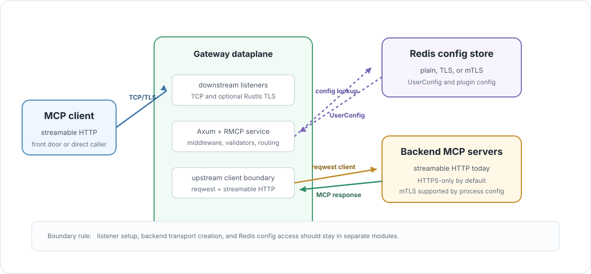

# Backend Connections And Transports

> 🚚 **Transport boundary:** downstream listener traffic, upstream backend
> traffic, and config-store traffic are separate concerns. Keep them separate
> even when they all use TCP underneath.



The gateway has three transport classes on the hot path. They are built in
different modules, configured from different fields, and serve different
architecture roles.

## Transport Classes

| Transport class | Current implementation | Main owner | Purpose |
| --- | --- | --- | --- |
| Downstream listener | Axum/Hyper over TCP and optional Rustls TLS. | `transports/` and `Gateway::run_gateway`. | Accept MCP streamable HTTP traffic from clients or the front door. |
| Upstream backend | Shared `reqwest::Client` plus RMCP `StreamableHttpClientTransport`. | `common.rs`, `gateway/mcp_service.rs`, and `gateway/backend_transports.rs`. | Open MCP client sessions to configured backend MCP servers. |
| Config store | Redis plain, TLS, or mTLS connection manager. | `common.rs` and `user_config_store/`. | Load `UserConfig` and plugin runtime config from control-plane authored storage. |

The current MCP dataplane only uses streamable HTTP for backend MCP traffic.
`BackendMCPGateway.transport` already has `STREAMABLEHTTP`, `SSE`, and `STDIO`,
but upstream routing does not branch on that field yet.

## Downstream Listeners

`Gateway::run_gateway` builds one Axum router and can expose it through TCP,
TLS, or both.

| Listener | Config fields | Behavior |
| --- | --- | --- |
| TCP | `address` | Binds a Tokio `TcpSocket`, sets reuse options and keepalive, listens with backlog `1024`, and serves Axum with graceful shutdown on `ctrl_c`. |
| TLS | `tls_address`, `server_certificate`, `server_private_key` | Builds a Rustls server config, accepts TLS by hand, then serves the same Axum router through Hyper. |

TLS listener setup has two important constraints:

| Constraint | Why |
| --- | --- |
| `tls_address` requires both certificate and private key. | The listener cannot build a Rustls server config without both. |
| `tls_address` cannot equal `address`. | TCP and TLS cannot bind the same socket in this process. |

The downstream TLS listener currently uses `with_no_client_auth()`. Client
identity is established by the gateway's bearer JWT layer, not by downstream
mTLS.

## Upstream Backend Client

The upstream HTTP client is built once at gateway startup:

```text
Config
  -> reqwest::Client::try_from(&config)
  -> clone per backend initialize task
  -> StreamableHttpClientTransport::with_client(...)
```

The process-level upstream mode controls whether backend URLs may use plain
HTTP, HTTPS, or HTTPS with client identity:

| Mode | `reqwest` behavior |
| --- | --- |
| unset | `https_only(true)`. Same as `TlsOnly`. |
| `TlsOnly` | HTTPS backends only. |
| `PlainTextOrTls` | HTTP or HTTPS backends. |
| `PlainTextOrMTls` | HTTP or HTTPS backends, with a client identity configured for TLS handshakes. |
| `MtlsOnly` | HTTPS backends only, with a client identity configured for TLS handshakes. |

If `upstream_trust_bundle` is configured, the PEM bundle is merged into the
client's TLS trust roots. For mTLS modes, the upstream certificate and private
key are read from disk and combined into a `reqwest::Identity`.

## Backend MCP Transport

During `initialize`, the selected virtual host fans out to every configured
backend:

```text
VirtualHost.backends
  -> for each backend URL
  -> build StreamableHttpClientTransportConfig
  -> serve GatewayBackendClient over StreamableHttpClientTransport
  -> store running service in BackendTransports
```

For HTTPS backend URLs, the gateway also sets a custom `Host` header from the
backend URL host and optional port. HTTP backend URLs do not get this custom
header in the current code.

Backend connection failures are not fatal to the whole initialize call. The
gateway stores the backend entry with no running service, so list calls can
continue with available backends and routed calls to that backend can fail
locally.

## Config-Store Transport

Redis is the current config-store transport. It is used for user config and,
when runtime plugins are enabled, plugin runtime config.

| Redis mode | Connection behavior |
| --- | --- |
| `PlainText` | Connects to `host:port` over TCP. |
| `Tls` | Connects with `rediss://host:port` and a required trust bundle. |
| `Mtls` | Connects with `rediss://host:port`, required trust bundle, required client certificate, and required client key. |

The Redis user config adapter stores:

```text
MessagePack(User::new(claims.sub)) -> MessagePack(UserConfig)
```

The Redis connection manager is configured with `1,000` retries. The adapter
keeps an in-process LRU cache in front of Redis, but routing code should only
depend on the `UserConfigStore` trait.

## What Should Move To Runtime Config

Transport security is mostly process config today. That keeps startup simple,
but it is not the final shape for every backend-specific decision.

| Setting | Today | Better long-term owner |
| --- | --- | --- |
| Downstream TLS certificate | Process config. | Process config. It belongs to the gateway listener. |
| Upstream trust bundle and mTLS identity | Process config. | Runtime config per backend or referenced secret material. |
| Backend auth headers | Not applied from `UserConfig` yet. | Runtime config per backend. |
| Backend transport type | Model field exists, not routed yet. | Runtime config per backend. |
| Header pass-through policy | Model field exists, not enforced yet. | Runtime config per backend or route policy. |

The boundary to preserve is simple: listener code should not know Redis schema,
MCP routing code should not know Redis command details, and backend transport
creation should stay behind a small, explicit upstream boundary.
