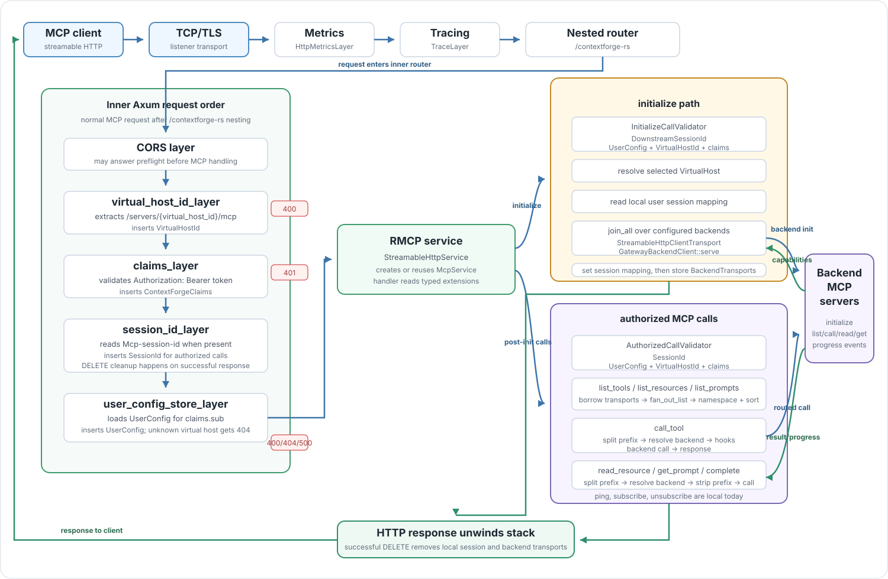

# Request Flow

> **Migration note:** the flow below documents the current session-oriented
> implementation. The downstream target is MCP `2026-07-28` with
> `server/discover` and per-request client context. Older clients and SSE remain
> on control-plane routes and do not enter this dataplane.

> 🎯 **Flow invariant:** Axum builds request context before RMCP handlers route MCP
> methods. MCP handlers should read typed extensions, not parse headers, paths,
> or Redis keys directly.



## Graph Legend

The graph uses color only to separate paths:

| Color | Meaning |
| --- | --- |
| Blue | Request direction: listener, middleware, RMCP dispatch, and backend calls. |
| Green | Response direction: backend result, response unwind, and client response. |
| Amber | `initialize`, where backend MCP client sessions are created. |
| Purple | Authorized MCP calls after `Mcp-session-id` exists. |
| Red | Layer-local HTTP rejection before MCP method handling. |

This page follows a normal streamable HTTP MCP request through the code. The
shape below is based on the current `main.rs`, `runtime.rs`, `Gateway::run_gateway`,
the request layers, and `McpService`. To watch the same flow with real requests,
follow [Run the Gateway Locally](running-the-gateway.md) alongside this page.

## Startup Path

Startup begins in `crates/contextforge-gateway-rs/src/main.rs`:

```text
install rustls crypto provider
  -> Config::parse()
  -> logging::init_tracing_logging(&config)
  -> Runtime::from(&config)
  -> optional CpexRuntimeRegistry
  -> Gateway::builder()
       .with_config(config)
       .with_user_config_store_type(UserConfigStoreType::Redis)
       .with_session_manager(LocalSessionManager::default())
       .with_plugin_runtime(...)
       .build()
  -> runtime.execute(gateway, plugin_registry)
```

`runtime.execute` either runs one multi-thread Tokio runtime or starts multiple
current-thread runtimes. In both modes it initializes the optional CPEX runtime
and then calls `gateway.run_gateway()`.

## HTTP Stack Order

`Gateway::run_gateway` builds the service stack in `crates/contextforge-gateway-rs-lib/src/lib.rs`.
Tower layers execute from the outside in, so a normal MCP request reaches the
handler in this order:

```text
TCP/TLS listener
  -> HttpMetricsLayer
  -> TraceLayer
  -> /contextforge-rs nested router
  -> CORS layer
  -> virtual_host_id_layer
  -> claims_layer
  -> session_id_layer
  -> user_config_store_layer
  -> virtual_host_config_layer
  -> /servers/{virtual_host_name}/mcp RMCP service
```

The inner Axum route is:

```text
/servers/{virtual_host_name}/mcp
```

The public route is nested under:

```text
/contextforge-rs/servers/{virtual_host_name}/mcp
```

The route segment is named `virtual_host_name`, but the layer stores the value
as `VirtualHostId`.

## Flow Checkpoints

| Checkpoint | Established fact | Next dependency |
| --- | --- | --- |
| Listener | The request reached the Rust dataplane over TCP or TLS. | Metrics, tracing, and nested routing can observe it. |
| Path extraction | The inner path matched `/servers/{virtual_host_id}/mcp`. | MCP handlers can resolve a `VirtualHost`. |
| Claims validation | The bearer token was accepted and `ContextForgeClaims` exists. | Config lookup can use `claims.sub`. |
| User config lookup | A `UserConfig` exists for the authenticated subject. | The virtual host check can run against that config. |
| Virtual host check | The path's virtual host id exists in the caller's config. | MCP validators can resolve the selected `VirtualHost`. |
| RMCP dispatch | The streamable HTTP request is mapped to an MCP method. | The handler chooses initialize, routed backend calls, or local behavior. |

## Middleware Context

The request layers insert the context used later by RMCP handlers:

| Layer | Request behavior | Failure behavior |
| --- | --- | --- |
| `virtual_host_id_layer` | Extracts `/servers/{virtual_host_id}/mcp` and inserts `VirtualHostId`. | Returns `400` when the inner path does not match. |
| `claims_layer` | Validates `Authorization: Bearer ...` with configured RS/HMAC decoder, issuer, audience, and expiration. Inserts `ContextForgeClaims`. | Returns `401` for missing or invalid bearer auth. |
| `session_id_layer` | Reads `Mcp-session-id` and inserts `SessionId` when present. | Missing session id is allowed here; authorized MCP handlers reject it later when required. |
| `user_config_store_layer` | Uses `claims.sub` as `User::new(subject)`, loads `UserConfig`, and inserts it. | Returns `400` for missing config, `500` for other store failures, and `400` if claims are absent. |
| `virtual_host_config_layer` | Checks that the path's virtual host id exists in the loaded `UserConfig`. | Returns `404` with body `{"detail":"Server not found"}` when the virtual host is not in the caller's config. |

For `DELETE`, `session_id_layer` also has response-side behavior. It lets RMCP
handle the request first. If the RMCP response succeeds and a session id exists,
it removes the local user session mapping and removes backend transports for
`principal + session_id`.

## Initialize Flow

`initialize` does not require the downstream `Mcp-session-id` header. RMCP
creates a `DownstreamSessionId` and places it in the request context.

`McpService::initialize` runs this sequence:

1. `InitializeCallValidator` reads `DownstreamSessionId`, `UserConfig`,
   `VirtualHostId`, and `ContextForgeClaims`.
2. It resolves `user_config.virtual_hosts[virtual_host_id]`.
3. It reads the local user session mapping for `claims.sub + downstream_session_id`.
4. For every backend in the selected virtual host, it concurrently builds a
   `StreamableHttpClientTransport` with the configured backend URL and serves a
   `GatewayBackendClient` over that transport.
5. It collects backend capabilities and running RMCP client services. The
   capabilities are stored with backend transport state and shape the downstream
   initialize response through a gateway-aware merge.
6. It writes the local user session mapping.
7. It stores each backend service in `BackendTransports` keyed by principal,
   backend name, and downstream session id.
8. It returns `InitializeResult` with the gateway's merged capability set.

Backend initialization is concurrent through `futures::future::join_all`.

## Authorized MCP Calls

Routed MCP calls after initialization use `AuthorizedCallValidator`. It requires:

```text
SessionId
UserConfig
VirtualHostId
ContextForgeClaims
```

The validator resolves the same virtual host from the authenticated user's
config, then `SessionManager` locates backend services for:

```text
principal + backend_name + session_id
```

Current routed method families:

| Method family | Flow |
| --- | --- |
| `list_tools`, `list_resources`, `list_prompts`, `list_resource_templates` | Decode the incoming gateway cursor (if present) to recover per-backend positions. On the first request (no cursor) all configured backend services are queried; on a resume request only backends that still have pages are queried. Call each selected backend concurrently via `fan_out_list`, passing its own per-backend cursor. Preserve identifiers for a single backend or namespace them for multiple backends. Sort the merged page output. Encode a new gateway cursor when at least one backend returned a `next_cursor`; omit it when all are exhausted. Explicit tool aliases are preserved exactly. An undecodable cursor returns `−32602 Invalid params`. |
| `call_tool` | Resolve an exact tool alias first; otherwise preserve the name for one backend or split `{backend_name}-{tool_name}` for multiple backends. Resolve one backend, run the optional tool hooks, track progress, call the backend, and return the result. |
| `read_resource`, `subscribe`, `unsubscribe`, `get_prompt` | Select the only backend and forward the identifier unchanged, or split and strip the prefix for a multi-backend host, then call the resolved backend. |
| `complete` | Apply the same conditional routing to the prompt name or resource URI in `ref`, then return the selected backend's completion result. |

`GatewayBackendClient` handles backend progress notifications for `call_tool`.
RMCP assigns a new progress token to each backend request, so the gateway maps
that backend token to the corresponding downstream token. Request enqueue and
mapping publication are serialized against progress lookup so an immediate
backend notification cannot overtake registration. When a notification matches
an in-flight backend token, the gateway restores the downstream token, optionally
runs the stream-event post hook, and forwards the notification to the downstream
client.

`call_backend_tool` also watches the downstream cancellation token. If the
downstream call is cancelled before the backend responds, the gateway sends a
cancel request to the backend handle.

## Local MCP Methods

Some MCP methods are currently local to the gateway implementation rather than
backend-routed:

| Method | Current behavior |
| --- | --- |
| `ping` | Returns success. |

This path still passes through the same HTTP middleware, but it does not use
backend fanout or identifier routing.

## Response Path

Backend responses return to `McpService` first. `call_tool` may run response
plugin hooks before returning.

List calls decode the incoming gateway cursor, fan out to the active backends,
merge the current page of output (preserving single-backend identifiers and
namespacing multi-backend identifiers as needed), and encode a new gateway
cursor when more pages remain across any backend.

The HTTP response then unwinds through `virtual_host_config_layer`,
`user_config_store_layer`, `session_id_layer`, `claims_layer`,
`virtual_host_id_layer`, CORS, trace, and metrics. On successful `DELETE`, `session_id_layer` performs local session and
backend transport cleanup during this unwind.
