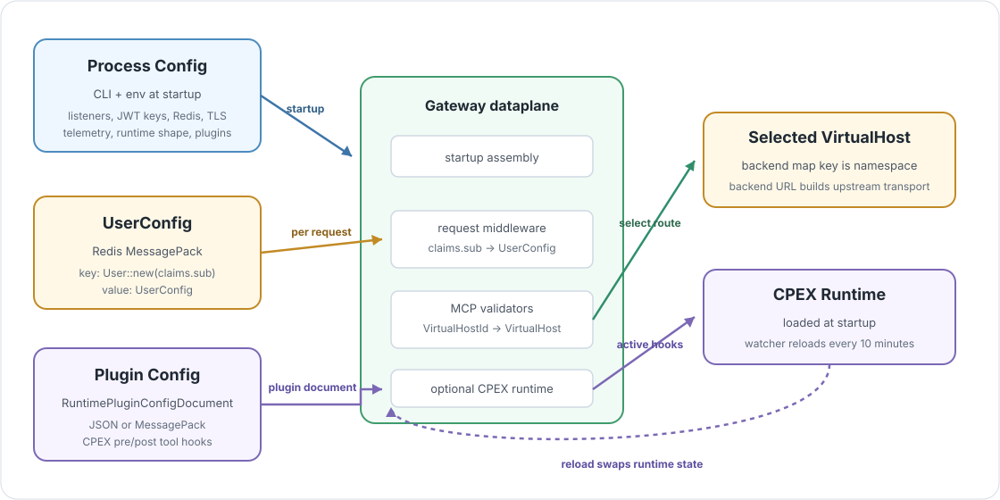

# Runtime Configuration

> 🗂️ **Config boundary:** process config tells the gateway how to run. Runtime
> user config tells each request where it may route. Plugin config controls the
> optional CPEX hook runtime.



The gateway consumes configuration from three places. Keeping them separate is
important because they change at different times and are used by different
parts of the dataplane.

## Config Surfaces

| Surface | Source | Loaded | Main user |
| --- | --- | --- | --- |
| Process `Config` | CLI flags and `CONTEXTFORGE_GATEWAY_RS_*` env vars parsed by `clap`. | Startup. | Listener setup, JWT decoder keys, Redis connection, upstream HTTP client, telemetry, runtime shape. |
| `UserConfig` | `UserConfigStore`, currently Redis through `RedisUserConfigStore`. | Per request after JWT validation. | Virtual host and backend selection. |
| `RuntimePluginConfigDocument` | Redis key `ContextForgeGatewayRuntimePluginConfig` when runtime plugins are enabled. | Startup and watcher reload. | CPEX tool pre/post hooks. |

The control plane owns durable authoring. This repo owns reading those values
and applying them on the request path.

## UserConfig Shape

The API crate defines the shared runtime routing model:

```text
UserConfig
  virtual_hosts: HashMap<String, VirtualHost>

VirtualHost
  backends: HashMap<String, BackendMCPGateway>

BackendMCPGateway
  name: String
  url: Url
  transport: Transport
  passthrough_headers: Vec<String>
  allowed_tool_names: Vec<String>
  allowed_resource_names: Vec<String>
  allowed_prompt_names: Vec<String>
```

`Transport` currently declares:

```text
STREAMABLEHTTP
SSE
STDIO
```

The Rust types above are easier to picture as JSON. For a complete, working
`UserConfig` document, see the seed request body in
[Run the Gateway Locally](running-the-gateway.md).

## What The MCP Dataplane Uses Today

The struct is already wider than the current MCP routing code. That is useful,
but the distinction should stay explicit:

| Config field | Current MCP dataplane behavior |
| --- | --- |
| `UserConfig.virtual_hosts` | Required. `VirtualHostId` from the path selects one entry. |
| `VirtualHost.backends` map key | Required. This key is the public backend namespace used in tool/resource/prompt prefixes. |
| `BackendMCPGateway.url` | Required. Used to build the upstream `StreamableHttpClientTransport`. |
| `BackendMCPGateway.name` | Present in the model. Current routing uses the backend map key, not this field, as the namespace. |
| `transport` | Present in the model. Current upstream code always builds a streamable HTTP client transport. |
| `passthrough_headers` | Present in the model. Current MCP routing does not apply header pass-through policy from this field. |
| `allowed_tool_names` | Present in the model. Current list/call routing does not enforce it. |
| `allowed_resource_names` | Present in the model. Current resource routing does not enforce it. |
| `allowed_prompt_names` | Present in the model. Current prompt routing does not enforce it. |

The current route selection is:

```text
JWT subject
  -> User::new(subject)
  -> UserConfig
  -> path VirtualHostId
  -> VirtualHost
  -> backend map key
  -> BackendMCPGateway.url
```

## Redis Storage

`RedisUserConfigStore` stores user routing config as MessagePack:

| Item | Encoding |
| --- | --- |
| Redis key | MessagePack-encoded `User::new(jwt_subject)`. |
| Redis value | MessagePack-encoded `UserConfig`. |
| Cache key | Raw subject string through `User::key()`. |
| Cache value | Decoded `UserConfig`. |

The in-process cache is an implementation detail:

| Setting | Value |
| --- | --- |
| Entries | 50,000 |
| Expiry | 1 hour |
| Redis connection retries | 1,000 |

Routing code should stay behind the `UserConfigStore` trait. That keeps Redis,
MessagePack, and cache behavior out of MCP method handling.

## Plugin Runtime Config

When `runtime_plugins_enabled` is true, startup builds a
`CpexRuntimeRegistry::with_redis_config(...)`. The registry reads a separate
runtime plugin document:

```text
Redis key: ContextForgeGatewayRuntimePluginConfig

RuntimePluginConfigDocument
  version: 1
  cpex: CpexConfig
```

The plugin config loader accepts JSON bytes or MessagePack bytes. It rejects
documents with the wrong version, missing `cpex` config, unsupported CPEX
features, or an unavailable config store.

Current supported plugin scope is deliberately narrow:

| CPEX feature | Current support |
| --- | --- |
| `TOOL_PRE_INVOKE` | Supported for `call_tool` before backend invocation. |
| `TOOL_POST_INVOKE` | Supported for `call_tool` responses and backend progress events. |
| CPEX routing | Rejected. Gateway routing is owned by `UserConfig` and MCP routing code. |
| Plugin conditions | Rejected. |
| Plugin dirs, global policies, global defaults | Rejected. |
| Other hook types | Rejected. |

The registry has a watcher interval of 10 minutes. On valid reloads it swaps in
the new runtime. On invalid reloads it marks the runtime failed so new plugin
calls return an internal MCP error until a valid config is applied.

## Process Config

Process `Config` is not per-user routing state. It is parsed once and controls
the gateway shell:

| Area | Examples |
| --- | --- |
| Listener | `address`, `tls_address`, downstream TLS certificate and private key. |
| Authentication | RSA public key path or HMAC secret for JWT verification. |
| Redis | Host, port, plain/TLS/mTLS mode, trust bundle, client cert, client key. |
| Upstream HTTP client | Plaintext/TLS/mTLS mode, upstream trust bundle, client cert, client key. |
| Telemetry | OpenTelemetry traces, metrics endpoint/protocol, OTLP headers, service name. |
| Runtime shape | CPU count and single-runtime versus multi-runtime mode. |
| Plugins | Whether runtime plugins are enabled. |
| Logging | Log name and rotation. |

The process config decides whether the gateway can start and what dependencies
it can reach. It does not decide which backend a specific MCP caller may use;
that remains in `UserConfig`.

## Selection Invariant

Backend selection should only happen after these facts exist:

```text
authenticated subject
  + loaded UserConfig
  + path VirtualHostId
  + MCP session context
```

That invariant is why runtime config access is in middleware and MCP validators,
not hidden inside individual backend calls.
