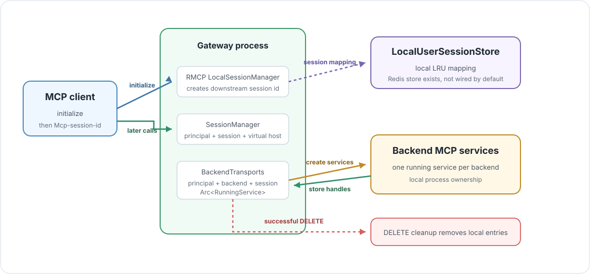

# Session Ownership

> 🧷 **Session invariant:** backend MCP services are local process state keyed
> by authenticated principal, backend namespace, and downstream MCP session id.



The current gateway keeps backend MCP client services in memory. That choice is
simple and fast, but it defines how initialized MCP sessions can be routed in a
deployment.

## Owned State

Several pieces of state participate in one MCP session. They do not all have
the same owner.

| State | Key | Owner today | Lifetime |
| --- | --- | --- | --- |
| RMCP downstream session | RMCP `DownstreamSessionId` and later `Mcp-session-id`. | RMCP `LocalSessionManager`. | Local process. |
| User session mapping | `UserSession { principal, downstream_session_id }`. | `LocalUserSessionStore`. | Local LRU cache, 50,000 entries, 1 hour. |
| Backend running service | `principal + backend_name + session_id`. | `BackendTransports`. | Local process. |
| Backend upstream MCP session | Managed inside RMCP running client service. | Backend service handle. | Local process and backend server. |

`RedisUserSessionStore` exists, but `Gateway::run_gateway` wires
`LocalUserSessionStore` today. Even if the user session mapping moved to Redis,
the live RMCP backend services in `BackendTransports` would still be local
unless that architecture changes too.

## Initialize Creates Backend Services

`initialize` is the ownership creation point:

```text
InitializeCallValidator
  -> selected VirtualHost
  -> claims.sub
  -> RMCP DownstreamSessionId
  -> one upstream client service per backend
  -> BackendTransports entries
```

The backend transport key is:

```text
BackendTransportKey
  principal: claims.sub
  backend_name: backend map key
  session_id: downstream session id
```

The backend map key matters because one downstream MCP session can fan out to
many backend MCP sessions. The principal matters because two callers could
present the same downstream session id value.

## Borrowing Backend Services

`SessionManager` is a request-scoped view over the selected virtual host,
session id, principal, and shared backend transport map.

| Operation | What it does |
| --- | --- |
| `get_backend_names()` | Reads backend namespaces from the selected `VirtualHost`. |
| `borrow_transports()` | Locks the map, finds entries for the current principal/session/backend names, and clones the shared `Arc<RunningService>`. |
| `cleanup_backends(reason)` | Removes backend entries for the current principal/session/backend names. |

`borrow_transports()` does not move services out of the map in the current
code. It clones shared service handles, so there is no return step after a
request completes.

## List Calls And Routed Calls

Backend service lookup splits into two patterns:

| MCP call shape | Session behavior |
| --- | --- |
| `list_tools`, `list_resources`, `list_prompts`, `list_resource_templates` | Borrow every available backend service for the selected virtual host, call them concurrently, then merge and namespace successful responses. |
| `call_tool`, `read_resource`, `get_prompt` | Split the prefixed name into `{backend_name}-{object_name}`, resolve the single backend service, strip the gateway prefix, and call that backend. |

An initialized backend entry can still contain no running service if backend
initialize failed. List calls skip unavailable backends. Routed calls to that
backend return a routing error.

If routed lookup ever detects duplicate backend matches, the session is treated
as invalid and `cleanup_backends` removes the local backend entries for that
principal and session.

## Delete Cleanup

`session_id_layer` owns response-side cleanup for downstream `DELETE`:

```text
DELETE with Mcp-session-id
  -> let RMCP handle the request
  -> if RMCP response is successful
  -> remove LocalUserSessionStore entry
  -> remove BackendTransports entries for principal + session id
```

Cleanup is intentionally tied to a successful downstream delete response. If
RMCP rejects the delete, the layer returns that response and leaves local
session state untouched.

## Load-Balancing Consequence

Random load balancing is not safe for stateful MCP sessions today. After
`initialize`, later requests with the same `Mcp-session-id` must reach the
process that owns the backend running services.

Known deployment options are:

| Option | Tradeoff |
| --- | --- |
| Sticky routing by `Mcp-session-id` | Simple, preserves local state, but couples sessions to one process. |
| External session ownership | More flexible, but backend running service state must move out of process or become reconstructible. |
| Reinitialize after failover | Operationally simple, but clients must tolerate session loss. |

Until backend service ownership changes, design request handling as if a
stateful MCP session belongs to one gateway process. The same constraint
appears inside one host in multi-runtime mode, where each runtime thread owns
its own backend transports; see
[Concurrency And Runtime Model](concurrency-and-runtime.md).
