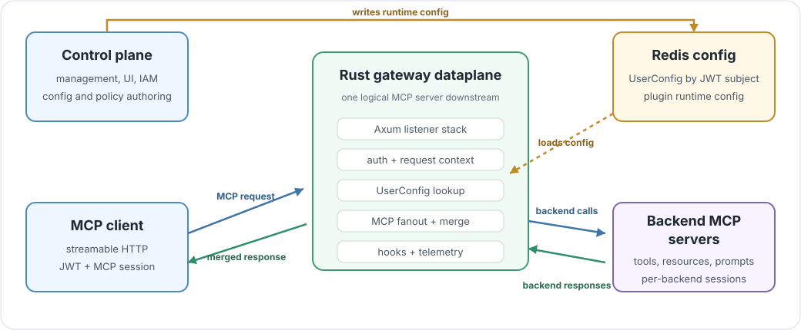

# System Shape

> 🧭 **Architecture lens:** this page explains what the gateway is, what it is
> not, and which code owns each boundary.



The ContextForge Gateway is the Rust dataplane process for MCP traffic. It is
not a second ContextForge application. It accepts downstream streamable HTTP MCP
requests, builds request context, loads runtime config, opens or reuses backend
MCP client sessions, and returns one merged MCP server view to the caller.

That shape matters because this repository sits on the traffic path. Its design
should bias toward predictable request behavior, explicit state ownership, and
small hot-path dependencies.

## Three-Layer Model

The gateway is easiest to reason about as three layers:

| Layer | Owns | Does not own |
| --- | --- | --- |
| ContextForge control plane | Management workflows, UI, IAM lifecycle, durable config ownership, policy authoring, observability storage. | Hot MCP request handling or in-process MCP sessions. |
| Rust gateway dataplane | Auth, config lookup, virtual host selection, MCP fanout, plugin hooks, telemetry emission, upstream calls. | Control-plane APIs, customer IAM, UI, durable metrics storage. |
| Backend MCP servers | Actual tools, resources, prompts, and backend protocol behavior. | Caller auth, virtual host selection, gateway-level policy. |

In text form, the same model is:

```text
ContextForge control plane
  -> writes runtime config and owns management workflows

contextforge-gateway-rs process
  -> authenticates, loads config, routes, fans out, applies hooks, emits signals

backend MCP servers
  -> own the actual tools, resources, and prompts
```

> **Boundary rule:** Redis is the current config-store transport, not the
> architecture. Routing code should depend on `UserConfigStore`, not Redis
> commands.

## Control Plane Boundary

The external ContextForge control plane owns the slow-changing product surface:

| Area | Why it stays outside this repo |
| --- | --- |
| Management APIs and UI | They are user/admin workflows, not request-path forwarding. |
| Credential and policy authoring | The dataplane consumes policy; it should not become the policy editor. |
| Persistent config ownership | Durable storage and schema lifecycle belong to the control plane. |
| Durable observability storage | The gateway emits telemetry; it should not become the metrics database. |
| Customer IAM lifecycle | The gateway validates presented identity, not the customer identity product. |

The Rust dataplane owns the hot path:

| Area | Code-facing meaning |
| --- | --- |
| Listener setup | Expose downstream TCP and/or TLS endpoints. |
| JWT validation | Convert bearer auth into request claims. |
| Runtime config lookup | Load the caller's `UserConfig` by JWT subject. |
| MCP fanout and routing | Present multiple backends as one MCP server. |
| Request and response hooks | Run plugin/policy hooks at explicit pipeline points. |
| Telemetry emission | Emit logs, traces, and metrics around the path. |

The front door can route only MCP traffic to this process while leaving other
ContextForge traffic on existing paths:

```text
/contextforge-rs/servers/{virtual_host_id}/mcp
```

From a client point of view, that endpoint behaves like one ContextForge MCP
server. Internally, it is a focused proxy, fanout, policy, and merge dataplane.

## Process Assembly

Startup begins in `crates/contextforge-gateway-rs/src/main.rs`. The binary crate
does process-level assembly:

```text
install rustls crypto provider
  -> Config::parse()
  -> logging::init_tracing_logging(&config)
  -> runtime::Runtime::from(&config)
  -> optional CpexRuntimeRegistry
  -> Gateway::builder()
       .with_config(config)
       .with_user_config_store_type(UserConfigStoreType::Redis)
       .with_session_manager(LocalSessionManager::default())
       .with_plugin_runtime(...)
       .build()
  -> runtime.execute(gateway, plugin_registry)
```

| Step | Owner | Result |
| --- | --- | --- |
| Parse config | Binary crate | A process config value used to build the gateway. |
| Initialize logging | Binary crate | Console/file logging and trace export are ready before serving traffic. |
| Select runtime | `runtime::Runtime` | Either one multi-thread Tokio runtime or multiple current-thread runtimes. |
| Start plugin runtime | CPEX registry path | Optional plugin manager and reloadable config loop. |
| Build gateway | `Gateway::builder()` | Dataplane dependencies are assembled and handed to the runtime. |

`runtime::Runtime` changes executor shape, not gateway semantics. The default
path is one multi-thread Tokio runtime. The binary crate also sets
`tikv_jemallocator` as the global allocator and owns file logging, console
logging, trace export, and metrics export setup.

## Gateway Assembly

`crates/contextforge-gateway-rs-lib/src/lib.rs` builds the dataplane stack in
`Gateway::run_gateway`:

```text
RedisUserConfigStore
LocalUserSessionStore
BackendTransports
reqwest::Client for backend MCP calls
RMCP StreamableHttpService<McpService>
Axum middleware stack
TCP and/or TLS listeners
```

The resulting route tree is:

```text
/contextforge-rs
  /servers/{virtual_host_name}/mcp
  /admin/...          local bootstrap helpers when with_tools is enabled
  /health            local bootstrap helper when with_tools is enabled
```

The route segment is named `virtual_host_name` in Axum, but the gateway extracts
the actual path value as a `VirtualHostId`. Routing code should treat it as a
virtual host id.

## Workspace Layers

The repository is a Cargo workspace with narrow responsibilities:

| Crate | Responsibility |
| --- | --- |
| `contextforge-gateway-rs` | Process shell: CLI config, logging, telemetry exporters, Tokio runtime, allocator, plugin registry startup, gateway construction. |
| `contextforge-gateway-rs-lib` | Dataplane library: Axum stack, request middleware, config lookup, MCP fanout/routing, backend sessions, upstream clients, downstream transports. |
| `contextforge-gateway-rs-apis` | Shared contract: `UserConfig`, `VirtualHost`, `BackendMCPGateway`, Redis user key, plugin config document, schema generation. |
| `contextforge-gateway-rs-cpex` | Plugin integration: CPEX runtime registry, Redis plugin config loading, supported tool pre/post hooks, stream event adaptation. |
| `contextforge-load-test` | Performance harness: end-to-end MCP traffic driver. |

Keep those boundaries stable. Adding dataplane behavior to the binary crate
makes the process shell harder to test and reuse. Adding control-plane behavior
to the library crate makes the hot path harder to reason about.

## Pipeline Shape

The current code builds a bidirectional MCP pipeline:

```text
downstream request
  -> virtual host extraction
  -> JWT validation
  -> session extraction
  -> user config lookup
  -> MCP handler validation
  -> request plugin hooks
  -> backend MCP call

upstream response
  -> response plugin hooks
  -> merge, namespace, or pass through
  -> metrics, tracing, and logging
  -> downstream response
```

The Axum layer registration order is important because Tower layers execute
from the outside in. The stack is built so the request reaches handlers with:

| Context | Inserted by | Used by |
| --- | --- | --- |
| `VirtualHostId` | `virtual_host_id_layer` | Initialize and authorized MCP validators. |
| `ContextForgeClaims` | `claims_layer` | Config lookup, session cleanup, routing. |
| `SessionId` | `session_id_layer` | Authorized MCP calls after initialize. |
| `UserConfig` | `user_config_store_layer` | Virtual host selection and backend selection. |

`initialize` is the special call. RMCP provides a downstream session id before
the gateway has a `Mcp-session-id` header. The gateway fans out to configured
backends, opens upstream MCP client sessions, and stores those running services
under:

```text
principal + backend_name + downstream_session_id
```

Later calls use the `Mcp-session-id` header to find those stored backend
services.

## State Ownership

The architecture keeps request state, session state, runtime config, and process
state in separate ownership scopes. The current ownership model is:

| State | Owner | Lifetime |
| --- | --- | --- |
| CLI `Config` | Binary startup and `Gateway` | Process lifetime. |
| JWT decoders | `ContextForgeGatewayAppState` | Process lifetime. |
| User config | `UserConfigStore`, currently Redis plus in-process LRU | Control-plane authored, request-path consumed. |
| Request identity | Request extensions | One HTTP request. |
| Virtual host id | Request extensions | One HTTP request. |
| Downstream session id | RMCP plus `SessionId` extension | MCP session. |
| Backend RMCP services | `BackendTransports` map | Local process, per principal/backend/session. |
| Local user session mapping | `LocalUserSessionStore` | Local process, per principal/session. |
| Runtime plugin manager | `CpexRuntimeRegistry` and handle | Process lifetime, reloadable. |
| Logs, traces, metrics | Logging setup and Axum/tower layers | Process lifetime. |

> **Session rule:** backend MCP services are local process state today.
> Load-balanced deployments need sticky routing, external session state, or a
> reinitialize-after-failover story.

Redis-backed user session storage exists in code, but the default gateway
assembly wires `LocalUserSessionStore`. Do not assume session state is durable
or shared across gateway nodes.

## Module Boundaries

The library crate has deliberately narrow internal module roles:

| Module | Owns |
| --- | --- |
| `common.rs` | CLI config shape, JWT claim shape, Redis config validation, upstream `reqwest::Client` construction. |
| `layers/` | HTTP request extension extraction and request-bound validation. |
| `gateway/` | MCP server behavior, initialize fanout, list merging, prefixed routing, backend service state. |
| `gateway/session_store/` | Local and Redis-capable user session storage abstractions. |
| `user_config_store/` | `UserConfigStore` trait and Redis-backed runtime config store. |
| `transports/` | Downstream TCP and TLS listener setup. |
| `tools.rs` | Local bootstrap helpers compiled only with `with_tools`. |

Concrete Redis commands stay behind `UserConfigStore`. Downstream listener
transport stays in `transports/`. MCP method behavior stays in `gateway/`.
Request extension extraction stays in `layers/`.

## Reusable Shell

The code is MCP-first today, but the repository is intentionally not named or
structured as only an MCP proxy. Authentication, configuration ingestion, TLS
handling, plugin execution, telemetry, runtime shape, and session strategy are
gateway-shell concerns.

MCP-specific behavior should remain isolated to the current MCP modules so
future A2A or model-provider routing can reuse the shell instead of growing a
parallel stack.

## Why These Architecture Pages Exist

The architecture section is split into subpages because each page tracks a
boundary that already exists in modules or runtime ownership:

| Subpage | Reason it exists |
| --- | --- |
| Request Flow | Shows the ordered path through startup, middleware, initialize, and authorized calls. |
| Authentication And User Config Lookup | Keeps identity and config selection separate from MCP method handling. |
| Runtime Configuration | Describes the data model the gateway consumes, independent of Redis transport details. |
| Backend Connections And Transports | Separates downstream, upstream, and config-store transports. |
| Session Ownership | Makes local backend session state and load-balancing constraints explicit. |
| Architectural Choices | Records tradeoffs that should not be changed accidentally. |

This split should make later pages easier to fill in without turning the
architecture chapter into one long mixed-concern essay.
