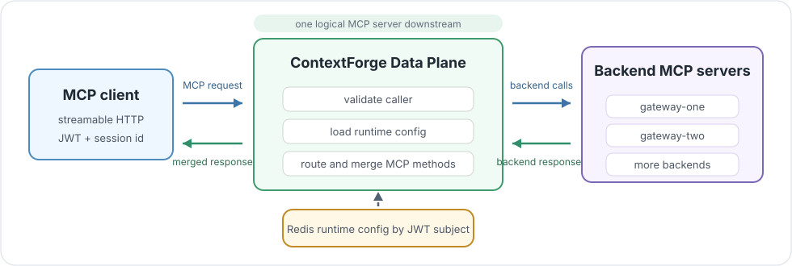

# What is ContextForge Gateway?

Welcome to the ContextForge Gateway book.

`contextforge-gateway-rs` is the Rust **dataplane** for ContextForge: a single
MCP entry point that sits in front of many backend MCP servers and makes them
look like one. If you have used an API gateway or reverse proxy for HTTP APIs,
this is the same idea for the Model Context Protocol (MCP).

Concretely, the gateway accepts MCP streamable HTTP traffic from a client,
authenticates the caller, loads that caller's runtime configuration, opens MCP
client sessions to the backend MCP servers that configuration allows, and
presents those backends to the client as one merged MCP server.

Throughout this book, *downstream* means the client side of the gateway and
*upstream* means the backend side.

> **Protocol boundary:** the downstream dataplane target is MCP `2026-07-28`
> over Streamable HTTP. Older MCP versions, legacy session initialization, and
> SSE remain on external ContextForge control-plane routes and do not enter the
> dataplane. The current session-oriented internals are temporary migration
> state, not a compatibility promise for direct dataplane clients.



Blue arrows show request traffic. Green arrows show backend responses returning
to the gateway and the merged MCP response going back to the client.

| Layer | What happens |
| --- | --- |
| Client edge | A modern MCP `2026-07-28` client calls `/contextforge-rs/servers/{virtual_host_id}/mcp` over Streamable HTTP with a bearer token and per-request client context. |
| Gateway hot path | The gateway validates identity, loads runtime config, selects the virtual host, and routes MCP methods. |
| Backend edge | The gateway opens or reuses MCP client sessions to configured backend MCP servers and merges what the client sees. |

> **Key idea:** downstream clients interact with one logical MCP server. The
> gateway decides which configured backend sessions are involved.

The gateway is not the management application. It does not own the UI, IAM
lifecycle, tenant administration, durable metrics storage, or long-lived
configuration editing. Those concerns stay in the external ContextForge control
plane. This repository owns the hot request path and the runtime pieces needed
to make that path fast, observable, and enforceable.

Most operators should not think about backend MCP servers directly. They should
think about one client-facing MCP endpoint:

```text
/contextforge-rs/servers/{virtual_host_id}/mcp
```

Behind that endpoint, the gateway has three main boundaries:

- the downstream boundary, where clients connect over streamable HTTP and
  present their bearer token and MCP `2026-07-28` per-request context
- the configuration boundary, where the gateway turns the JWT subject into a
  runtime `UserConfig`
- the upstream boundary, where the gateway opens or reuses MCP client sessions
  to the configured backend servers

Most bugs in this service come from confusing those boundaries. A downstream
request is not allowed to pick arbitrary upstream backends. Redis is not the
routing model; it is the current config-store transport. Backend sessions are
not durable cluster state; they are local process state today.

| Boundary | Input | Output | Owner |
| --- | --- | --- | --- |
| Downstream | HTTP request, JWT, MCP headers | request extensions and downstream session id | gateway |
| Configuration | JWT subject and virtual host id | `UserConfig` and selected `VirtualHost` | control plane data, gateway enforcement |
| Upstream | selected backend names and URLs | running backend MCP client services | gateway |

## Key terms

These words appear on almost every page. It is worth pinning them down once.

| Term | Meaning in this book |
| --- | --- |
| Dataplane | The process on the live request path (this repository). It handles MCP traffic. |
| Control plane | The external ContextForge application that authors config, policy, and identity. It is not in this repository. |
| Downstream | The client side of the gateway: the calling MCP client and its requests. |
| Upstream | The backend side of the gateway: the configured backend MCP servers. |
| Virtual host | A named routing group inside the caller's config. The URL path selects exactly one. |
| Backend | One configured MCP server behind the gateway. Its map key becomes a routing prefix when a virtual host has multiple backends. |
| Principal | The authenticated caller identity, taken from the JWT `sub` claim. |
| Session | An initialized MCP session, tracked by `Mcp-session-id`, that owns the per-caller backend client sessions. |

## Mental model

The gateway is easiest to understand as one logical MCP server assembled from a
set of configured backend MCP servers.

On `initialize`, the gateway validates the caller, resolves the requested
virtual host, and creates upstream MCP client sessions for that virtual host's
backends. On list calls, it fans out to those backends and merges the result. On
targeted calls, it uses an explicit tool alias, the only configured backend, or
a multi-backend prefix to route to exactly one backend.

For a stateful MCP call to work, five facts must line up:

```text
JWT subject
  -> user config
  -> virtual host id
  -> downstream MCP session id
  -> backend session map entries
```

If any part is missing, the gateway should fail at the layer that owns that
fact: auth, config lookup, virtual host resolution, session lookup, routing, or
upstream transport.

> **Operational consequence:** stateful MCP traffic needs session affinity
> until backend session state moves out of the gateway process.

## Non-goals

This repository should not grow control-plane behavior by accident. It should
not become the admin UI, tenant management API, policy authoring system,
credential store, or durable observability backend.

It also should not expose backend topology as more than the MCP routing
contract requires. Backend map keys are visible when multi-backend identifiers
need prefixes, but clients should still experience one gateway endpoint and
one logical MCP server.

## Where to go next

- To run the gateway yourself, start with [Getting Started](usage.md).
- To understand how requests move through it, read [Architecture](architecture.md).
- For the exact client-facing protocol behavior, see [MCP Behavior](mcp-behavior.md).
